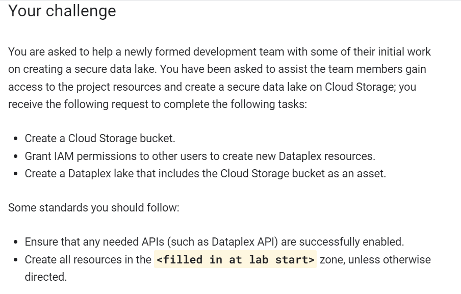
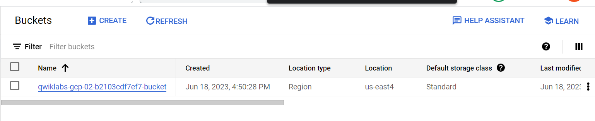
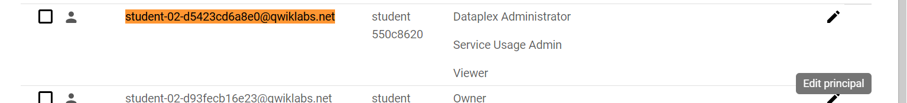
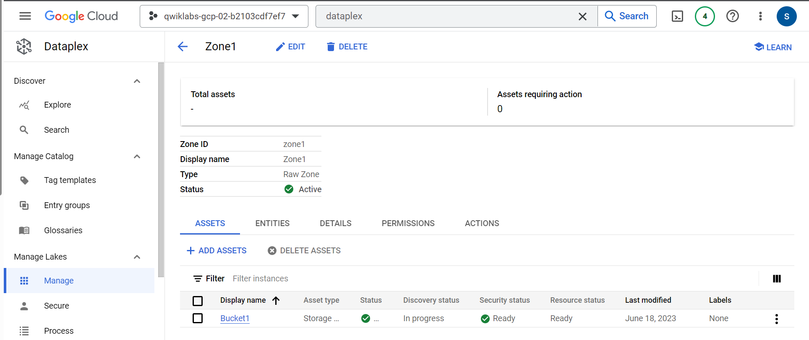

# <https§§§www.cloudskillsboost.google§games§4112§labs§26505>
> <https://www.cloudskillsboost.google/games/4112/labs/26505>

# Create a Secure Data Lake on Cloud Storage: Challenge Lab

## Task 1. Create a Cloud Storage bucket

us-east4 zone

## Task 2. Update IAM permissions for another user

Grant IAM permissions to other users to create new Dataplex resources.
Create a Dataplex lake that includes the Cloud Storage bucket as an asset.

## Task 3. Create a lake in Dataplex and add a zone to your lake

