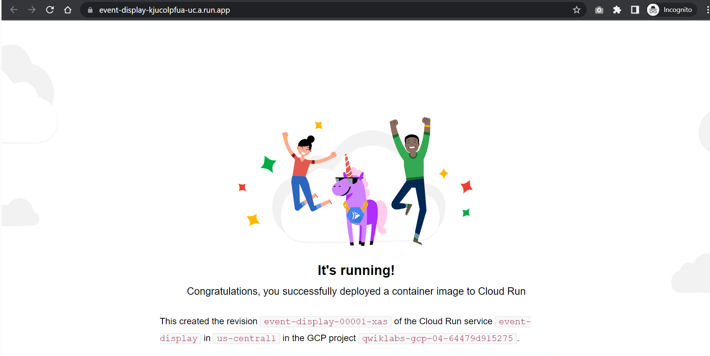

# <https§§§www.cloudskillsboost.google§games§4112§labs§26507>
> <https://www.cloudskillsboost.google/games/4112/labs/26507>

# Eventarc for Cloud Run

## Task 1. Set up your environment

gcloud config set project qwiklabs-gcp-04-64479d915275

gcloud config set run/region us-central1

gcloud config set run/platform managed

gcloud config set eventarc/location us-central1

## Task 2. Enable service account

student_04_78501b37196c@cloudshell:~ (qwiklabs-gcp-04-64479d915275)$ export PROJECT_NUMBER="$(gcloud projects list \
  --filter=$(gcloud config get-value project) \
  --format='value(PROJECT_NUMBER)')"
eYour active configuration is: [cloudshell-26965]
cstudent_04_78501b37196c@cloudshell:~  
student_04_78501b37196c@cloudshell:~ (qwiklabs-gcp-04-64479d915275)$ echo $PROJECT_NUMBER
366561572865
 

gcloud projects add-iam-policy-binding $(gcloud config get-value project) \
  --member=serviceAccount:${PROJECT_NUMBER}-compute@developer.gserviceaccount.com \
  --role='roles/eventarc.admin'

## Task 3. Event discovery

gcloud beta eventarc attributes types list

## Task 4. Create a Cloud Run sink

export SERVICE_NAME=event-display

export IMAGE_NAME="gcr.io/cloudrun/hello"

gcloud run deploy ${SERVICE_NAME} \
  --image ${IMAGE_NAME} \
  --allow-unauthenticated \
  --max-instances=3

## Task 5. Create a Cloud Pub/Sub event trigger

gcloud beta eventarc triggers create trigger-pubsub \
  --destination-run-service=${SERVICE_NAME} \
  --matching-criteria="type=google.cloud.pubsub.topic.v1.messagePublished"

export TOPIC_ID=$(gcloud eventarc triggers describe trigger-pubsub \
  --format='value(transport.pubsub.topic)')

gcloud eventarc triggers list

gcloud pubsub topics publish ${TOPIC_ID} --message="Hello there"

## Task 6. Create a Audit Logs event trigger

export BUCKET_NAME=$(gcloud config get-value project)-cr-bucket

gsutil mb -p $(gcloud config get-value project) \
  -l $(gcloud config get-value run/region) \
  gs://${BUCKET_NAME}/

gcloud beta eventarc attributes types describe google.cloud.audit.log.v1.written

gcloud beta eventarc triggers create trigger-auditlog \
--destination-run-service=${SERVICE_NAME} \
--matching-criteria="type=google.cloud.audit.log.v1.written" \
--matching-criteria="serviceName=storage.googleapis.com" \
--matching-criteria="methodName=storage.objects.create" \
--service-account=${PROJECT_NUMBER}-compute@developer.gserviceaccount.com

gcloud eventarc triggers list

gsutil cp random.txt gs://${BUCKET_NAME}/random.txt

gcloud eventarc triggers delete trigger-auditlog