# <https§§§www.cloudskillsboost.google§games§4112§labs§26510>
> <https://www.cloudskillsboost.google/games/4112/labs/26510>

# Cloud Monitoring: Qwik Start

## Task 1. Create a Compute Engine instance

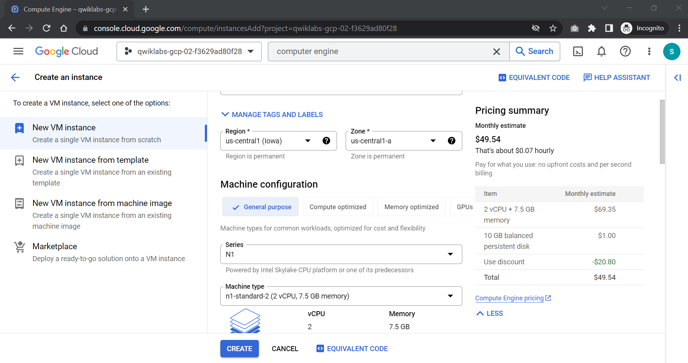

## Task 2. Add Apache2 HTTP Server to your instance

The Cloud Monitoring agent is a collected-based daemon that gathers system and application metrics from virtual machine instances and sends them to Monitoring. By default, the Monitoring agent collects disk, CPU, network, and process metrics. Configuring the Monitoring agent allows third-party applications to get the full list of agent metrics. On the Google Cloud, Operations website, see Cloud Monitoring Documentation for more information.

curl -sSO https://dl.google.com/cloudagents/add-google-cloud-ops-agent-repo.sh

sudo bash add-google-cloud-ops-agent-repo.sh --also-install

sudo systemctl status google-cloud-ops-agent"*"

sudo apt-get update

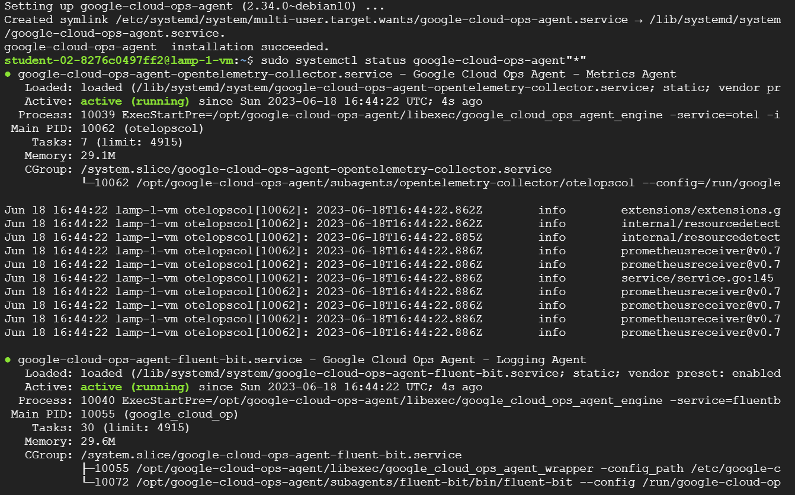

## Task 3. Create an uptime check

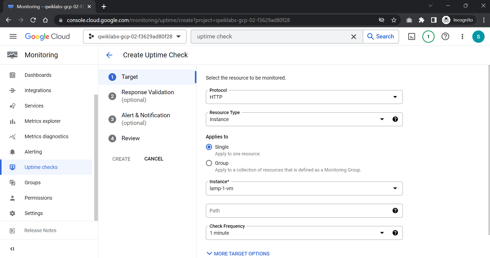

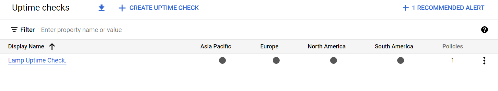

## Task 4. Create an alerting policy

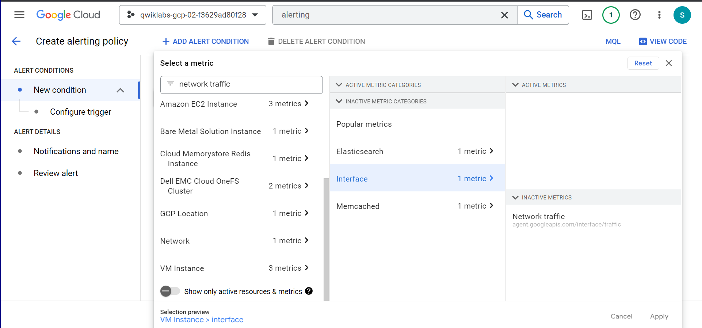

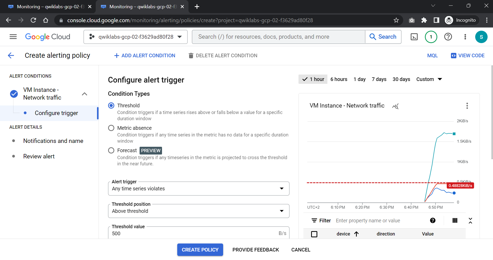

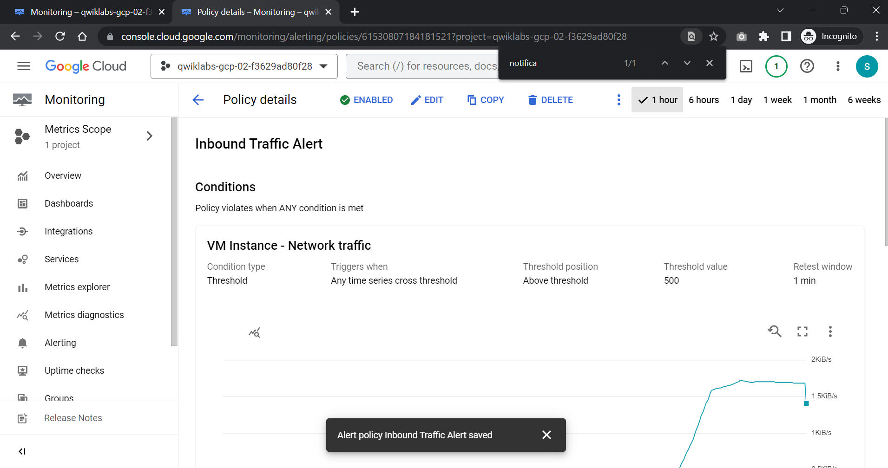

## Task 5. Create a dashboard and chart

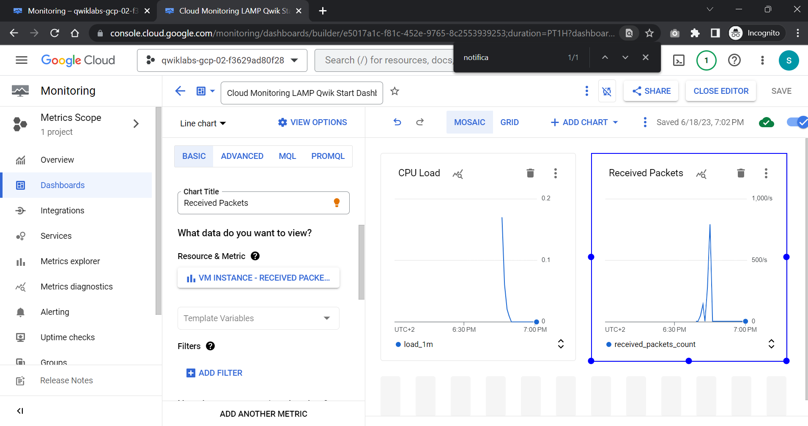

## Task 6. View your logs

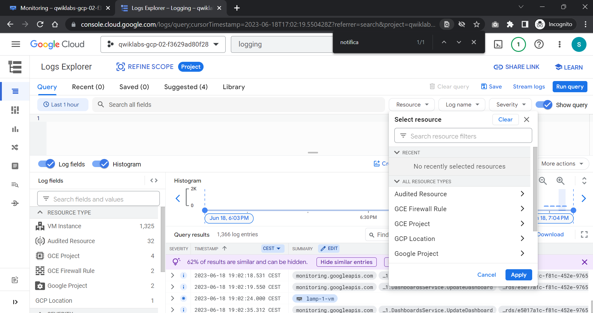

streams log

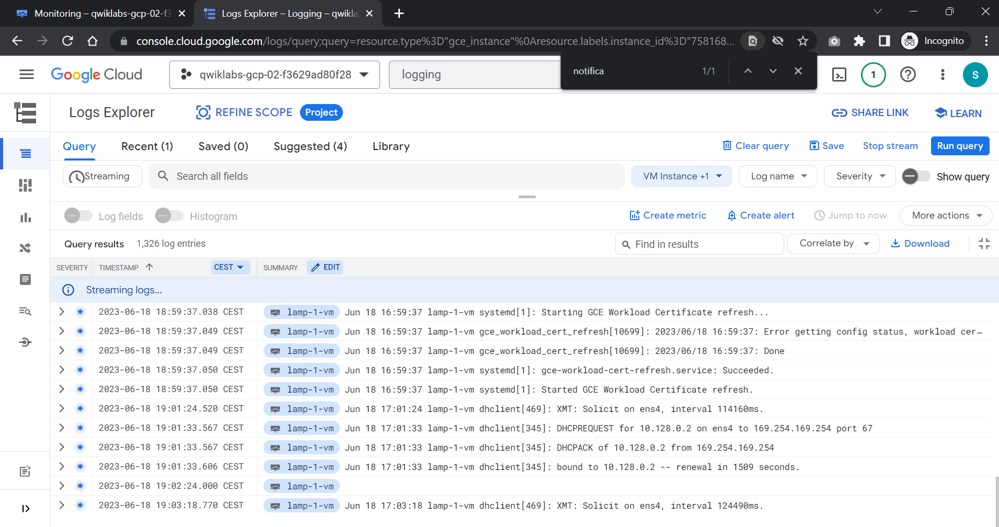

## Task 7. Check the uptime check results and triggered alerts

stop vm

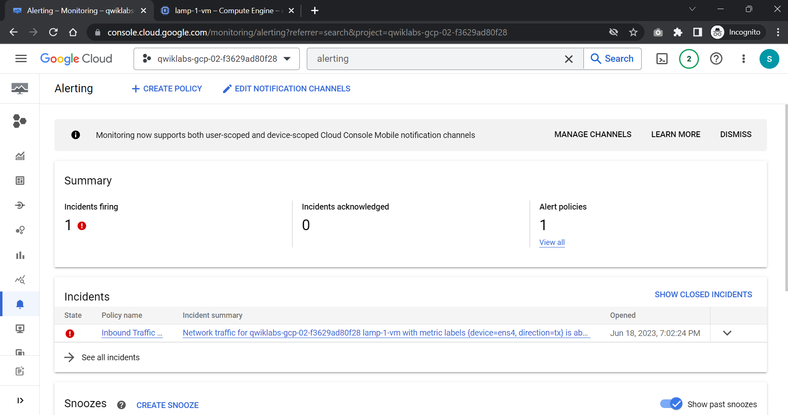
 
 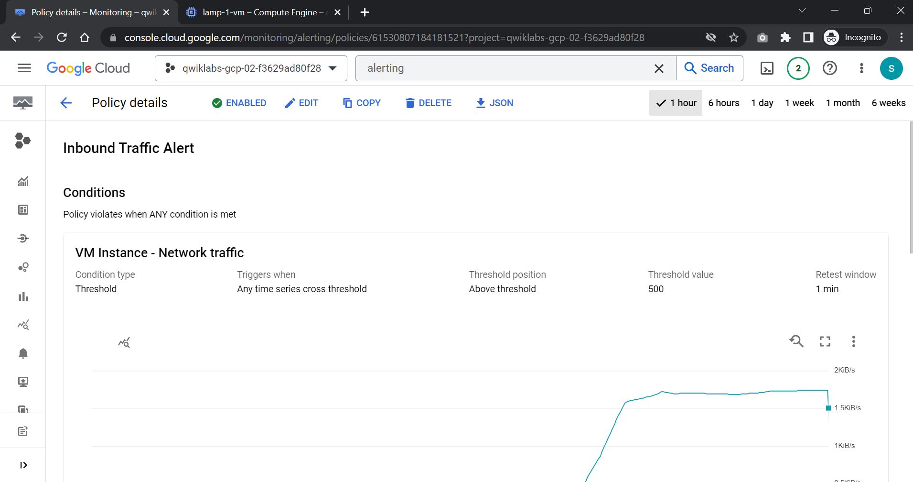

 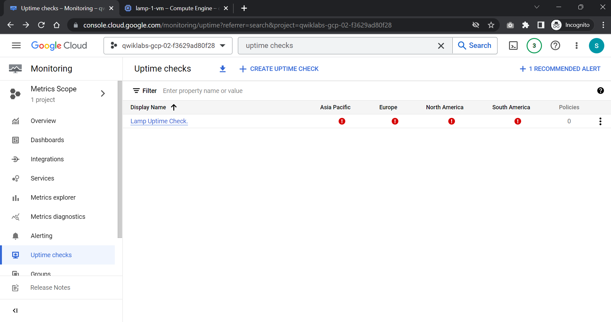

 You will see Lamp Uptime Check listed. Since you have just restarted your instance, the regions are in a failed status. It may take up to 5 minutes for the regions to become active. Reload your browser window as necessary until the regions are active.

https://www.cloudskillsboost.google/quests/35

https://www.cloudskillsboost.google/quests/33