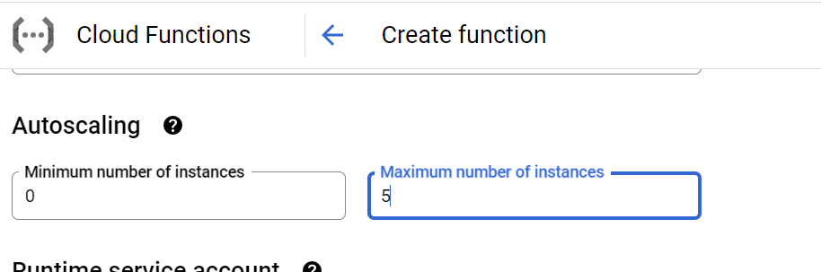
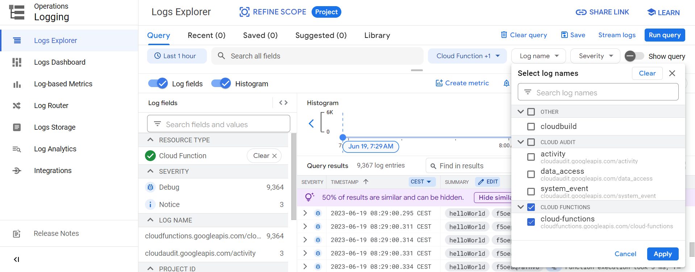
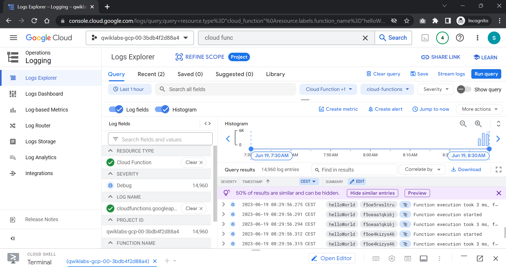
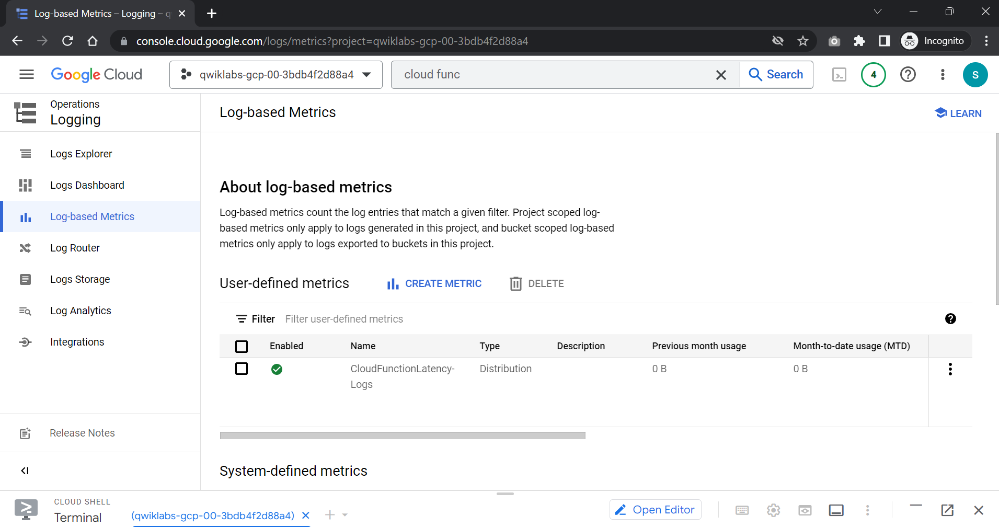
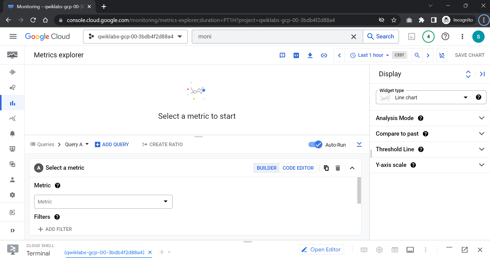
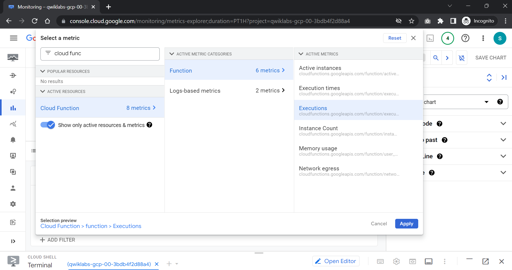
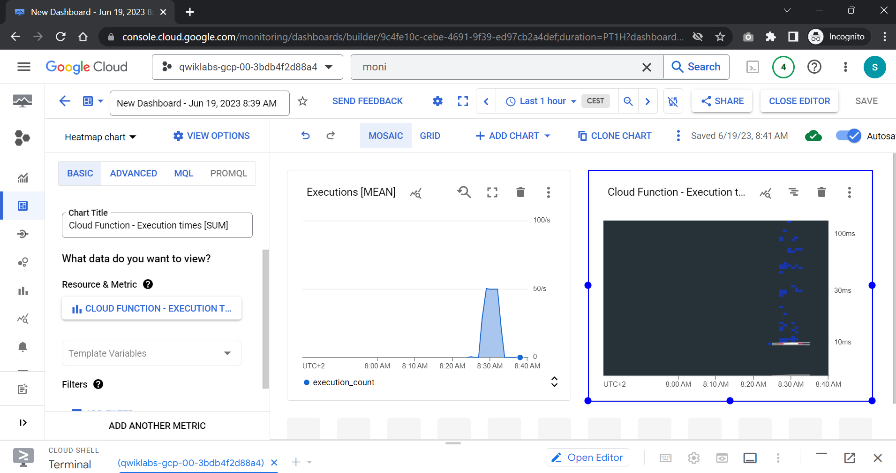

# <https§§§www.cloudskillsboost.google§games§4112§labs§26511>
> <https://www.cloudskillsboost.google/games/4112/labs/26511>


# Monitoring and Logging for Cloud Functions

## Task 1. Viewing Cloud Function logs & metrics in Cloud Monitoring




curl -LO 'https://github.com/tsenart/vegeta/releases/download/v6.3.0/vegeta-v6.3.0-linux-386.tar.gz'
tar xvzf vegeta-v6.3.0-linux-386.tar.gz


Trigger URL for your function

echo "GET https://us-east1-qwiklabs-gcp-00-3bdb4f2d88a4.cloudfunctions.net/helloWorld" | ./vegeta attack -duration=300s > results.bin

## Task 2. Create logs-based metric




run query



```
 resource.type="cloud_function"
 resource.labels.function_name="helloWorld"
 logName="projects/qwiklabs-gcp-00-3bdb4f2d88a4/logs/cloudfunctions.googleapis.com%2Fcloud_functions"
 ```

## Task 3. Metrics Explorer





Cloud Function > Function > Executions

## Task 4. Create charts on the Monitoring Overview window



