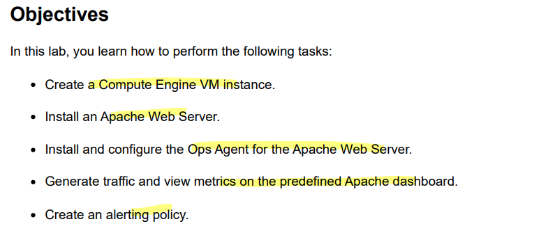
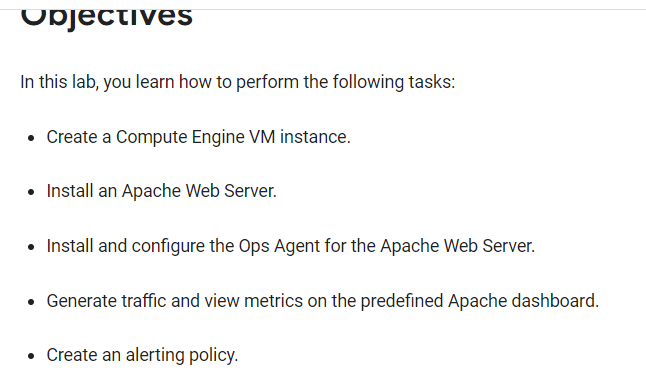
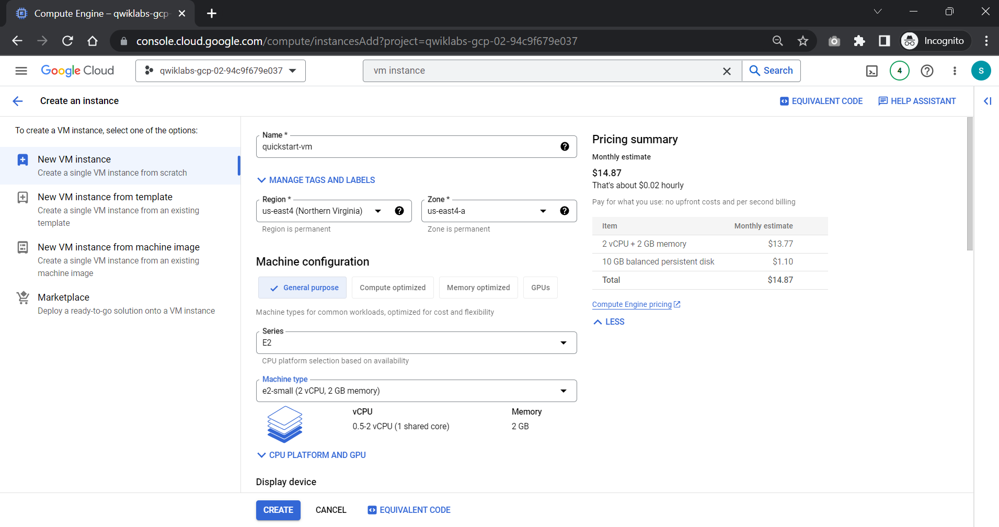
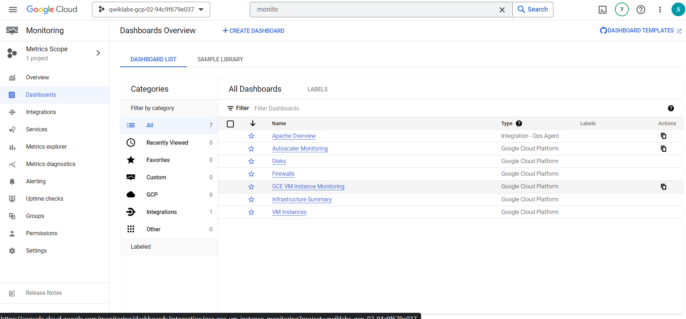
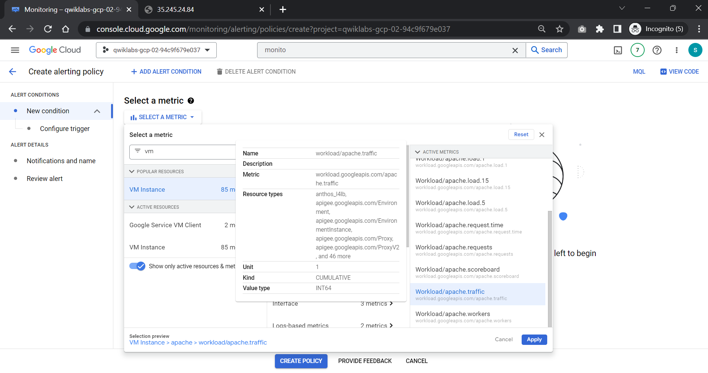
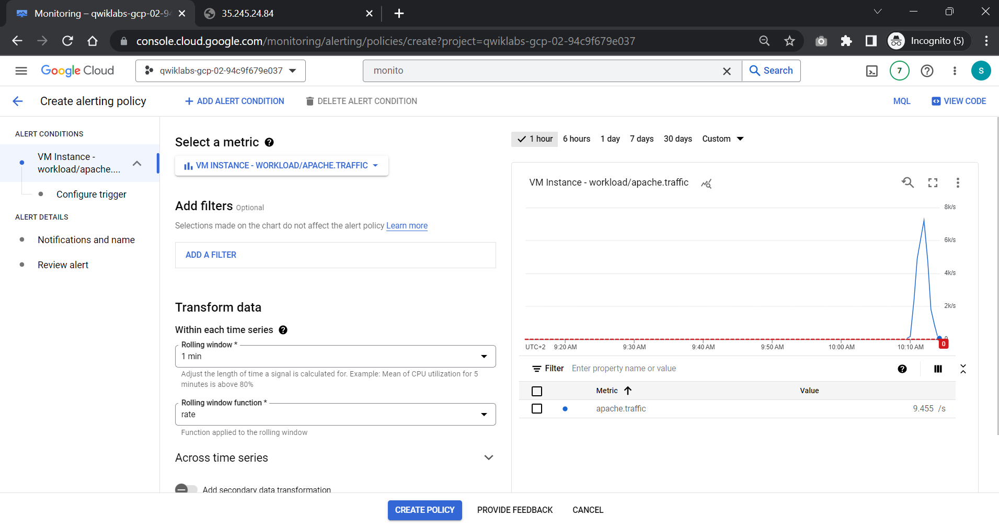
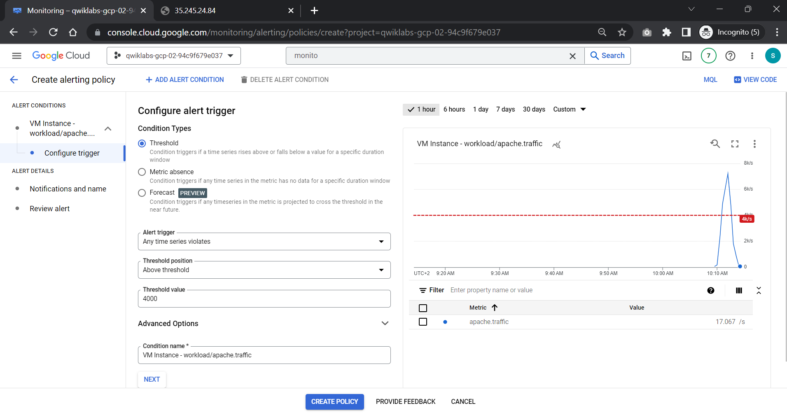
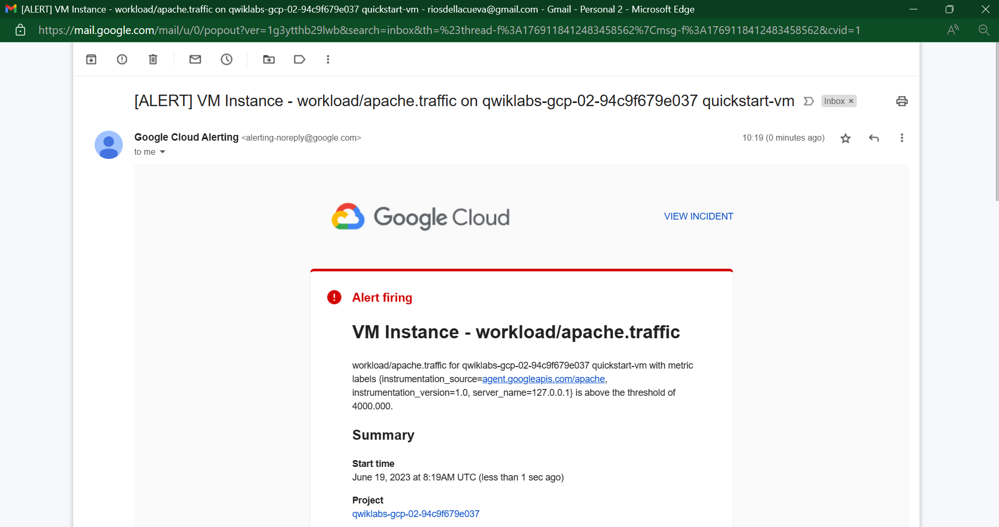

# <https§§§www.cloudskillsboost.google§games§4112§labs§26512>
> <https://www.cloudskillsboost.google/games/4112/labs/26512>

# Monitor a Compute Engine Virtual Machine: Qwik Start



## Task 1. Create a Compute Engine VM instance



## Task 1. Create a Compute Engine VM instance



## Task 2. Install an Apache Web Server

sudo apt-get update
sudo apt-get install apache2 php7.0

## Task 3. Install and configure the Ops Agent

https://cloud.google.com/logging/docs/agent/ops-agent

curl -sSO https://dl.google.com/cloudagents/add-google-cloud-ops-agent-repo.sh
sudo bash add-google-cloud-ops-agent-repo.sh --also-install


```bash
# Configures Ops Agent to collect telemetry from the app and restart Ops Agent.
set -e
# Create a back up of the existing file so existing configurations are not lost.
sudo cp /etc/google-cloud-ops-agent/config.yaml /etc/google-cloud-ops-agent/config.yaml.bak
# Configure the Ops Agent.
sudo tee /etc/google-cloud-ops-agent/config.yaml > /dev/null << EOF
metrics:
  receivers:
    apache:
      type: apache
  service:
    pipelines:
      apache:
        receivers:
          - apache
logging:
  receivers:
    apache_access:
      type: apache_access
    apache_error:
      type: apache_error
  service:
    pipelines:
      apache:
        receivers:
          - apache_access
          - apache_error
EOF
sudo service google-cloud-ops-agent restart
sleep 60
```

The previous command creates the configuration to collect and ingest logs and metrics from the Apache Web Server. For more information about ingesting logs from the Apache Web Server, see Configure the Ops Agent for Apache Web Server.


## Task 4. Generate traffic and view metrics

you generate metrics on your Apache Web Server and view metric data on the automatically created Apache GCE Overview dashboard.

```bash
timeout 120 bash -c -- 'while true; do curl localhost; sleep $((RANDOM % 4)) ; done'
```



## Task 5. Create an alerting policy







## Task 6. Test the alerting policy

```bash
timeout 120 bash -c -- 'while true; do curl localhost; sleep $((RANDOM % 4)) ; done'
```

