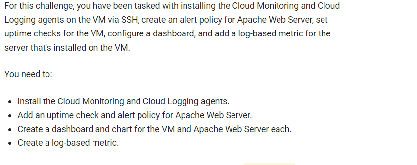
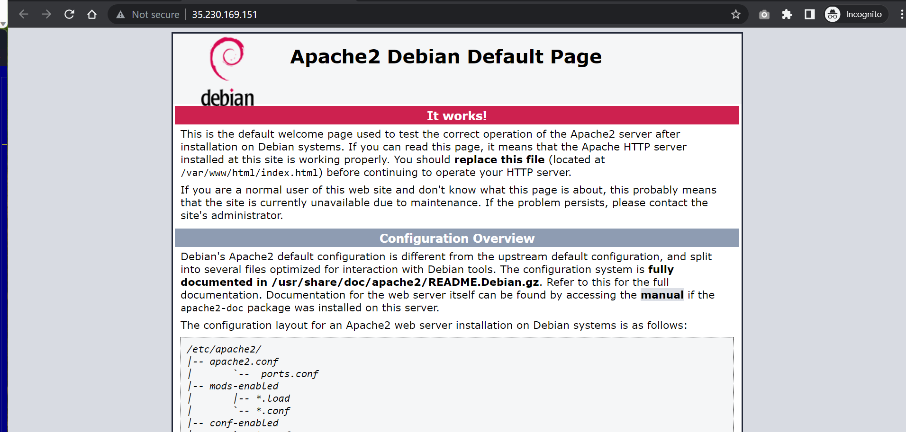
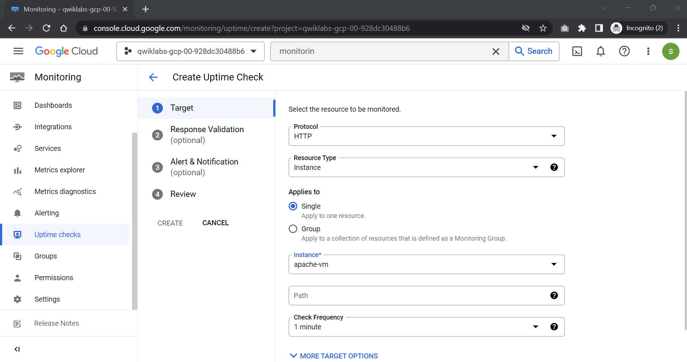
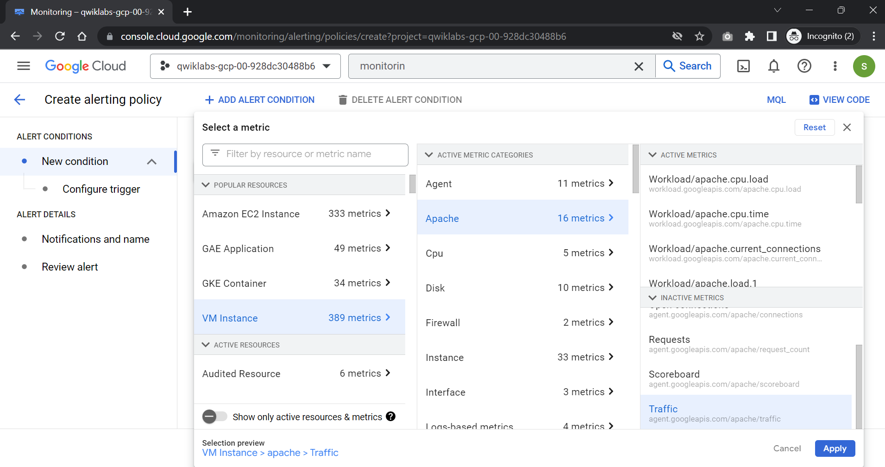
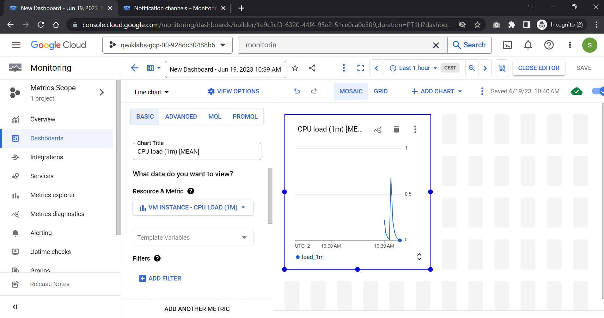
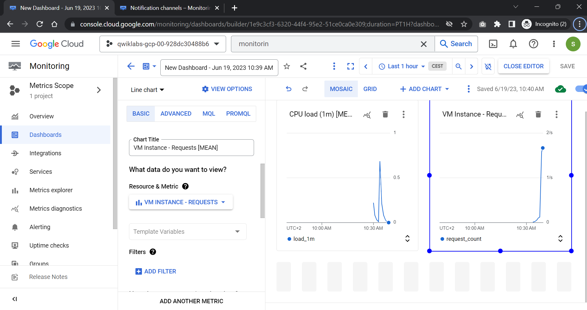
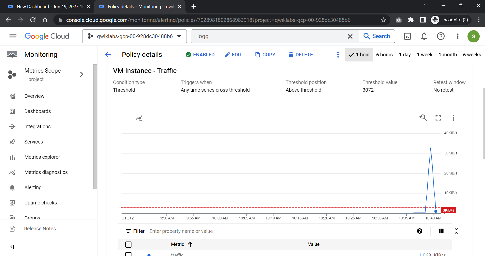
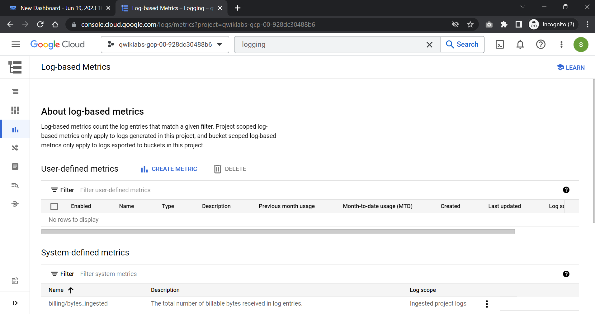
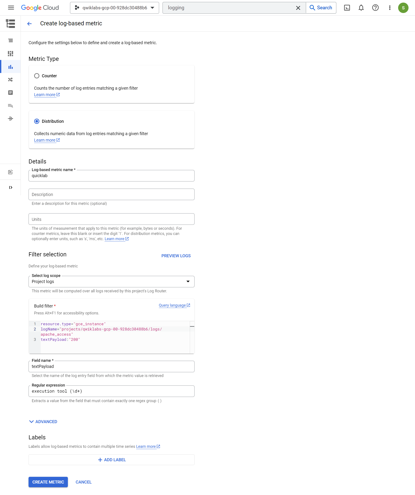

# <https§§§www.cloudskillsboost.google§games§4112§labs§26513>
> <https://www.cloudskillsboost.google/games/4112/labs/26513>

# Monitoring in Google Cloud: Challenge Lab

## Task 1. Install the Cloud Logging and Monitoring agents

curl -sSO https://dl.google.com/cloudagents/add-logging-agent-repo.sh
sudo bash add-logging-agent-repo.sh --also-install

curl -sSO https://dl.google.com/cloudagents/add-monitoring-agent-repo.sh
sudo bash add-monitoring-agent-repo.sh --also-install

(cd /etc/stackdriver/collectd.d/ && sudo curl -O https://raw.githubusercontent.com/Stackdriver/stackdriver-agent-service-configs/master/etc/collectd.d/apache.conf)

sudo service stackdriver-agent restart

## Task 2. Add an uptime check for Apache Web Server on the VM

## Task 3. Add an alert policy for Apache Web Server

timeout 120 bash -c -- 'while true; do curl localhost | grep -oP ".*"; sleep .1s;done '

## Task 4. Create a dashboard and charts for Apache Web Server on the VM

CPU load (1m)

## Task 5. Create a log-based metric

resource.type="gce_instance"
logName="projects/qwiklabs-gcp-00-928dc30488b6/logs/apache_access"
textPayload:"200"

execution tool (\d+)

