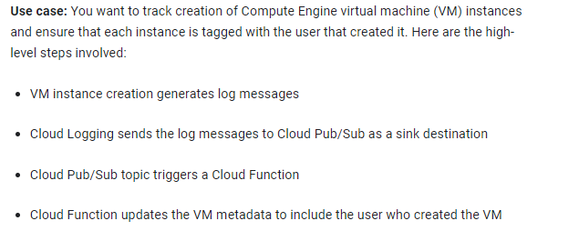
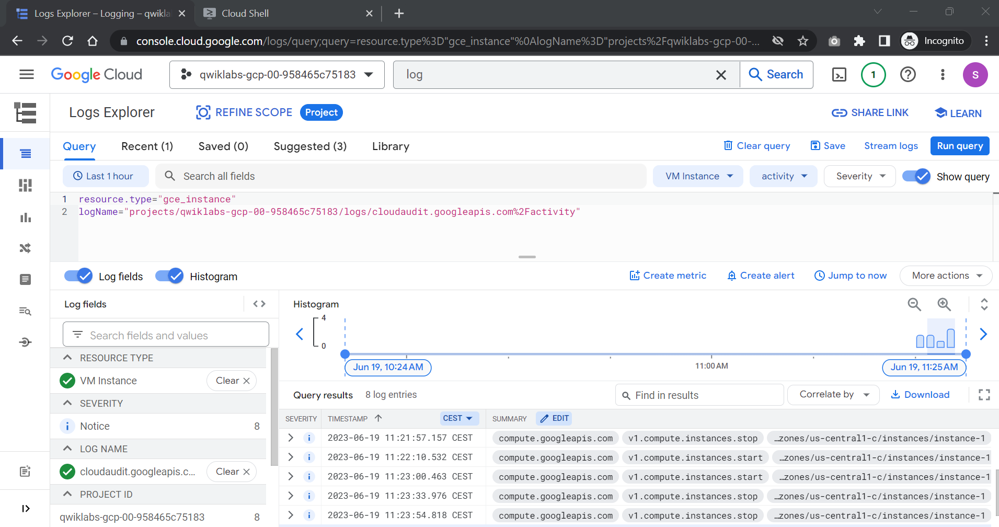
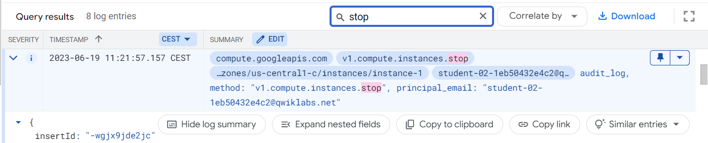
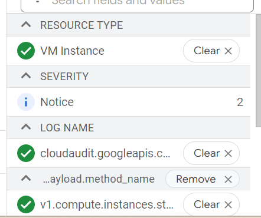
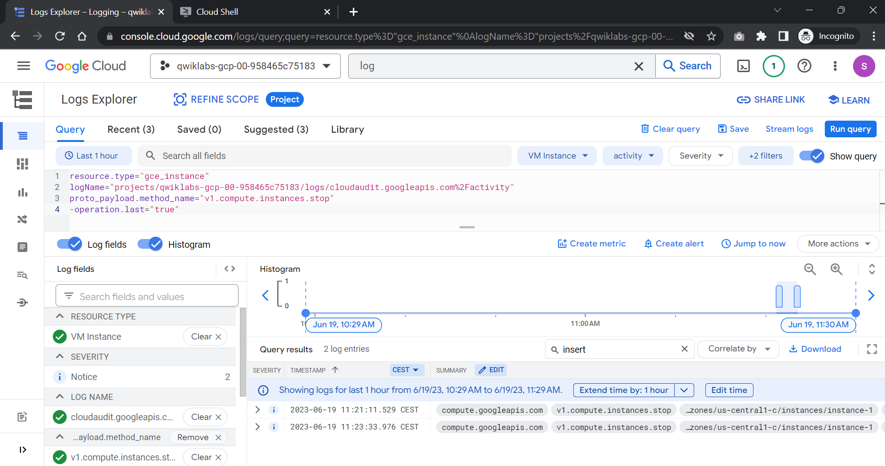
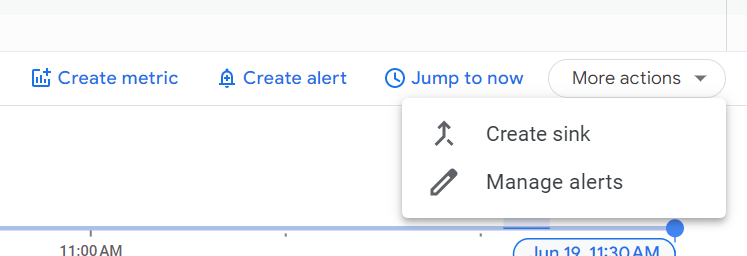
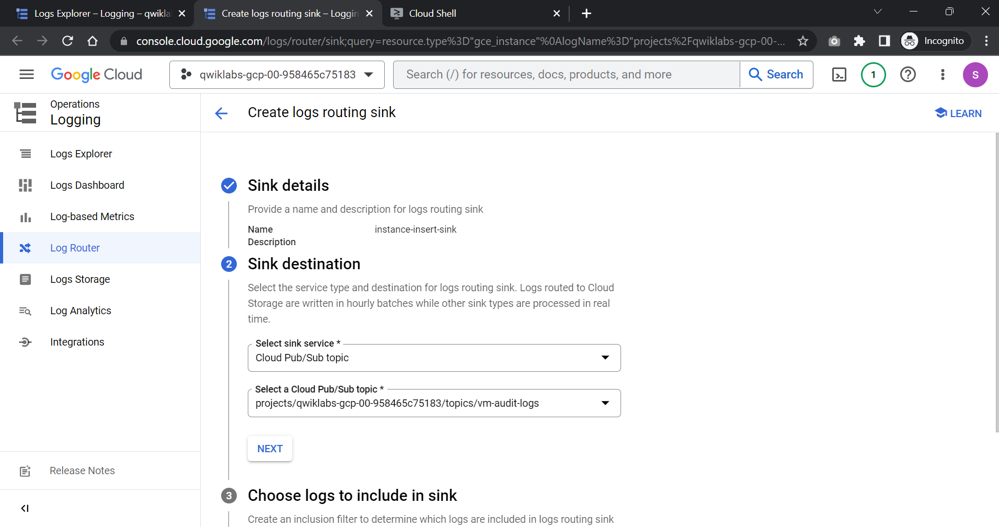
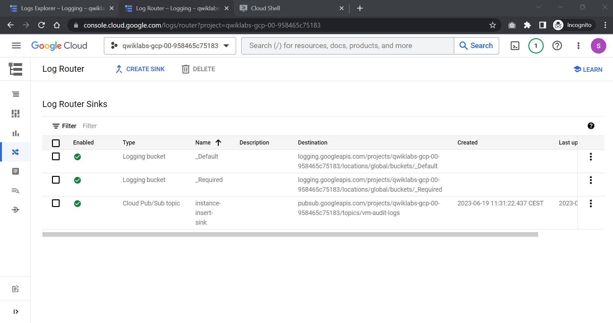
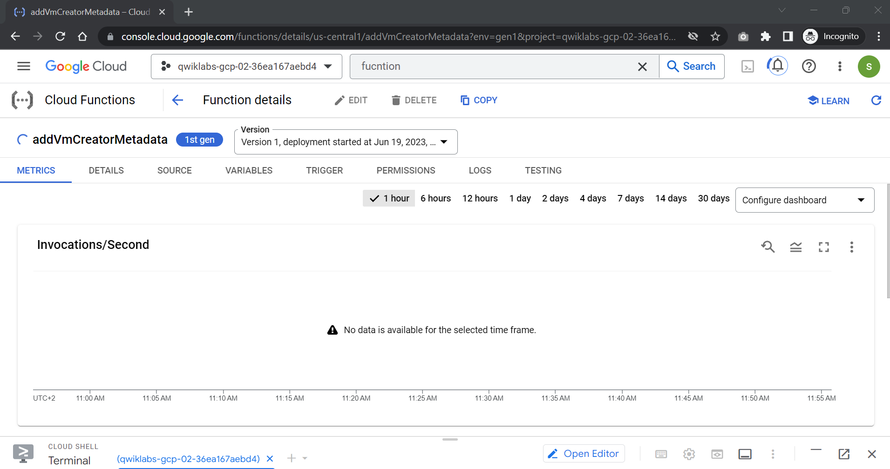
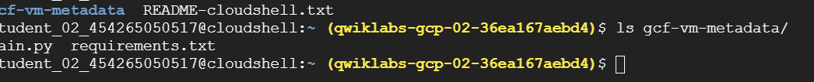

# <https§§§www.cloudskillsboost.google§games§4112§labs§26515>
> <https://www.cloudskillsboost.google/games/4112/labs/26515>

# Responding to Cloud Logging Messages with Cloud Functions



What you'll learn
How to filter and export Cloud Logging messages to Cloud Pub/Sub

How to trigger Cloud Functions from Pub/Sub

How to write a Cloud Function to do simple processing

How to update a VM's metadata

##  Task 1. Create a Cloud Pub/Sub topic

```bash
gcloud pubsub topics create vm-audit-logs
```

## Task 2. Generate some Compute Engine log messages

use case is to reposnd to log msg generated by vm activity

```bash
export ZONE=us-central1-c
gcloud compute instances create --zone $ZONE instance-1

# stop for now
gcloud compute instances stop --zone $ZONE instance-1
```

## Task 3. Configure filters

Cloud Logging can export logs to Cloud Storage, BigQuery, and Cloud Pub/Sub. You can include or exclude log messages from the export using filters.

[https://cloud.google.com/logging/docs/view/building-queries](https§§§cloud.google.com§logging§docs§view§building-queries/readme.md)




filter






## Task 4. Configure log export

from log explorer




log router



```log
resource.type="gce_instance"
log_name="projects/qwiklabs-gcp-02-36ea167aebd4/logs/cloudaudit.googleapis.com%2Factivity"
protoPayload.methodName="v1.compute.instances.insert"
operation.last = "true"
```
## Task 5. Create a simple Cloud Function




## Task 6. Update Cloud Function logic to add VM metadata

```bash

mkdir ~/gcf-vm-metadata


cat > ~/gcf-vm-metadata/main.py <<'EOF'
import base64
import json
import googleapiclient.discovery
def tag_with_creator(event, context):
    """Adds a custom metadata entry for a new virtual machine.
    Triggered by a Cloud Pub/Sub message containing a Compute Engine
    audit activity Stackdriver log message
    """
    pubsub_message = base64.b64decode(event['data']).decode('utf-8')
    msg_json = json.loads(pubsub_message)
    proto_payload = msg_json['protoPayload']
    resource_name = proto_payload['resourceName']
    email = proto_payload['authenticationInfo']['principalEmail']
    # compute engine API
    compute = googleapiclient.discovery.build(
        'compute', 'v1', cache_discovery=False)
    # full name is of the form
    # projects/$PROJ_NAME/zones/$ZONE/instances/$INST_NAME
    name_tokens = resource_name.split('/')
    project = name_tokens[1]
    zone = name_tokens[3]
    instance_name = name_tokens[5]
    # need to get current vm metadata before we can update it
    vm_details = compute.instances().get(
        project=project, zone=zone, instance=instance_name).execute()
    vm_metadata = vm_details['metadata']
    # add/replace metadata item
    _update_metadata(vm_metadata, 'creator', email)
    response = compute.instances().setMetadata(
        project=project, zone=zone, instance=instance_name,
        body=vm_metadata).execute()
    print('Updated metadata for resource %s' % resource_name)
def _update_metadata(vm_meta, key, value):
    """Update existing vm metadata with the supplied key/value pair.
    If the key already exists, value is overwritten.
    """
    if 'items' not in vm_meta:
        vm_meta['items'] = []
    for item in vm_meta['items']:
        if item['key'] == key:
            item['value'] = value
            return
    vm_meta['items'].append({
        'key': key,
        'value': value
    })
EOF
```
The code interacts with the Compute Engine API, so you need to include the appropriate client library in the set of dependencies.


requirements.txt

```bash
cat > ~/gcf-vm-metadata/requirements.txt <<'EOF'
google-api-python-client==1.7.4
EOF
```




update the cf

```bash
gcloud functions deploy addVmCreatorMetadata --source ~/gcf-vm-metadata --entry-point tag_with_creator
```

## Task 7. Trigger the Cloud Function by creating a VM

```bash
gcloud compute instances start --zone $ZONE instance-1

gcloud compute instances create --zone $ZONE instance-2
```