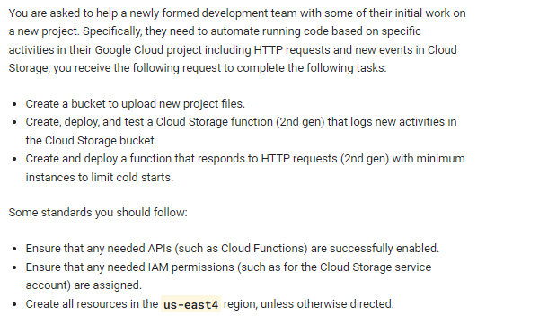
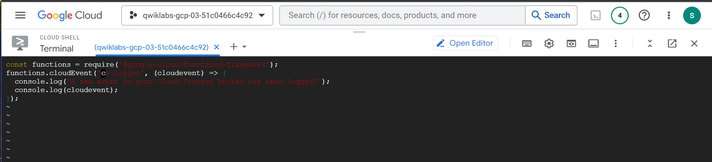
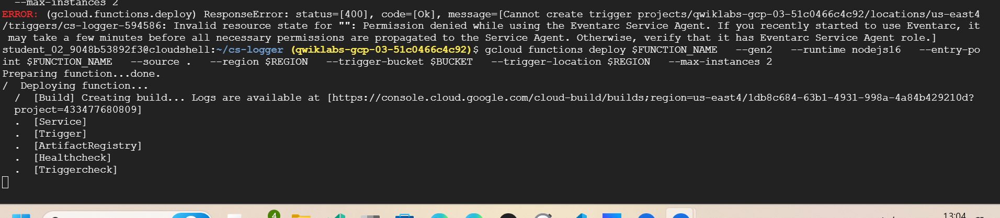
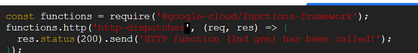
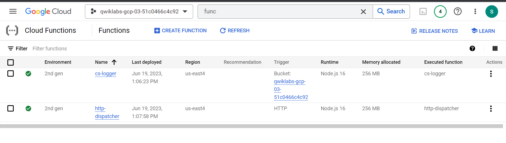

# <https§§§www.cloudskillsboost.google§games§4112§labs§26516>
> <https://www.cloudskillsboost.google/games/4112/labs/26516>

# Cloud Functions: 3 Ways: Challenge Lab



us-east4

 

## Task 1. Create a Cloud Storage bucket

```bash
Create a Cloud Storage bucket in GIVEN_REGION using your Project ID as the bucket name.

export HTTP_FUNCTION=http-dispatcher
export FUNCTION_NAME=cs-logger
export REGION=us-east4
export BUCKET=gs://qwiklabs-gcp-03-51c0466c4c92

gcloud services enable \
  artifactregistry.googleapis.com \
  cloudfunctions.googleapis.com \
  cloudbuild.googleapis.com \
  eventarc.googleapis.com \
  run.googleapis.com \
  logging.googleapis.com \
  pubsub.googleapis.com

PROJECT_NUMBER=$(gcloud projects list --filter="project_id:$DEVSHELL_PROJECT_ID" --format='value(project_number)')
SERVICE_ACCOUNT=$(gsutil kms serviceaccount -p $PROJECT_NUMBER)
gcloud projects add-iam-policy-binding $DEVSHELL_PROJECT_ID \
  --member serviceAccount:$SERVICE_ACCOUNT \
  --role roles/pubsub.publisher

```
## Task 2. Create, deploy, and test a Cloud Storage function (2nd gen)

```bash
mkdir ~/$FUNCTION_NAME && cd $_
touch index.js && touch package.json
```



```bash

gcloud functions deploy $FUNCTION_NAME \
  --gen2 \
  --runtime nodejs16 \
  --entry-point $FUNCTION_NAME \
  --source . \
  --region $REGION \
  --trigger-bucket $BUCKET \
  --trigger-location $REGION \
  --max-instances 2
```




## Task 3. Create and deploy a HTTP function (2nd gen) with minimum instances

```bash
cd ..

mkdir ~/$HTTP_FUNCTION && cd $_
touch index.js && touch package.json
```



```bash

gcloud functions deploy $HTTP_FUNCTION \
  --gen2 \
  --runtime nodejs16 \
  --entry-point $HTTP_FUNCTION \
  --source . \
  --region $REGION \
  --trigger-http \
  --timeout 600s \
  --max-instances 2 \
  --min-instances 1

```




