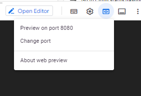
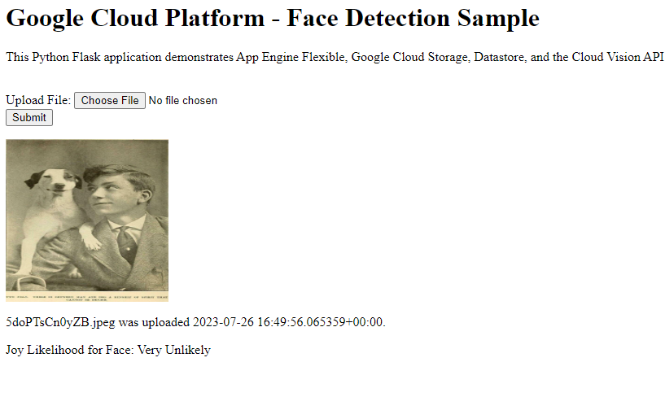

# <https§§§www.cloudskillsboost.google§games§4255§labs§27514>
> <https://www.cloudskillsboost.google/games/4255/labs/27514>
        
## Task 1. Get the sample code

gcloud storage cp -r gs://spls/gsp023/flex_and_vision/ .


##  Task 2. Authenticate API requests

```bash
#Set an environment variable for your Project ID:

export PROJECT_ID=$(gcloud config get-value project)
 
#Create a Service Account to access the Google Cloud APIs when testing locally:

gcloud iam service-accounts create qwiklab --display-name "My Qwiklab Service Account"
 
# Give your newly created Service Account appropriate permissions:

gcloud projects add-iam-policy-binding ${PROJECT_ID} \
--member serviceAccount:qwiklab@${PROJECT_ID}.iam.gserviceaccount.com \
--role roles/owner
Copied!
# After creating your Service Account, create a Service Account key:

gcloud iam service-accounts keys create ~/key.json --iam-account qwiklab@${PROJECT_ID}.iam.gserviceaccount.com
 
#This command generates a service account key stored in a JSON file named key.json in your home directory.

#Using the absolute path of the generated key, set an environment variable for your service account key:

export GOOGLE_APPLICATION_CREDENTIALS="/home/${USER}/key.json"
 
```


## Task 3. Testing the application locally

```bash

# crete venv
virtualenv -p python3 env

source env/bin/activate

pip install -r requirements.txt

```

Creating an App Engine app

gcloud app create

> Select a region that supports App Engine Flexible for Python then press ENTER.

Creating a storage bucket

export CLOUD_STORAGE_BUCKET=${PROJECT_ID}

gsutil mb gs://${PROJECT_ID}


Running the Application

python main.py






## Task 4. Exploring the code

> see files 

Task 5. Deploying the App to App Engine Flexible


```
gcloud config set app/cloud_build_timeout 1000
gcloud app deploy

```

[
    
](https://<project_id>.appspot.com/)