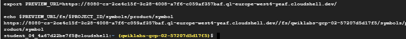

# <https§§§www.cloudskillsboost.google§games§4255§labs§27515>
> <https://www.cloudskillsboost.google/games/4255/labs/27515>


# Use Go Code to Work with Google Cloud Data Sources

## Task 1. Prepare your environment

```
export PROJECT_ID=$(gcloud info --format="value(config.project)")
go version
git clone https://github.com/GoogleCloudPlatform/DIY-Tools.git

```

Prepare your databases

```
gcloud firestore import gs://$PROJECT_ID-firestore/prd-back
```

> It takes a few minutes to import data into Firestore. The import process loads a Firestore backup of a collection called symbols into the $PROJECT_ID-firestore storage bucket. This is sample data that is common to retailers and contains UPC and product information.


## Task 2. Review the Google Cloud Data Drive source code

## Task 3. Check the import process

## Task 4. Compile and run Google Cloud Data Drive application in Cloud Shell

```
cd ~/DIY-Tools/gcp-data-drive/cmd/webserver

go build -mod=readonly -v -o gcp-data-Drive

./gcp-data-drive
```

## Task 5. Test the application in your browser


```
[https://8080-cs-2ce4c15f-3c28-4008-a7f6-c059af357baf.ql-europe-west4-yeaf.cloudshell.dev/](https§§§8080-cs-2ce4c15f-3c28-4008-a7f6-c059af357baf.ql-europe-west4-yeaf.cloudshell.dev§/readme.md)


export PROJECT_ID=$(gcloud info --format="value(config.project)")

export PREVIEW_URL=https://8080-cs-2ce4c15f-3c28-4008-a7f6-c059af357baf.ql-europe-west4-yeaf.cloudshell.dev/

echo $PREVIEW_URL/fs/$PROJECT_ID/symbols/product/symbol
```




url is 
```
[https://8080-cs-2ce4c15f-3c28-4008-a7f6-c059af357baf.ql-europe-west4-yeaf.cloudshell.dev/fs/qwiklabs-gcp-02-57207d5d17f5/symbols/product/symbol](https§§§8080-cs-2ce4c15f-3c28-4008-a7f6-c059af357baf.ql-europe-west4-yeaf.cloudshell.dev§fs§qwiklabs-gcp-02-57207d5d17f5§symbols§product§symbol/readme.md)


 use bq

[https://8080-cs-2ce4c15f-3c28-4008-a7f6-c059af357baf.ql-europe-west4-yeaf.cloudshell.dev/bq/](https§§§8080-cs-2ce4c15f-3c28-4008-a7f6-c059af357baf.ql-europe-west4-yeaf.cloudshell.dev§bq§/readme.md)

[https://8080-cs-2ce4c15f-3c28-4008-a7f6-c059af357baf.ql-europe-west4-yeaf.cloudshell.dev/bq/qwiklabs-gcp-02-57207d5d17f5/publicviews/ca_zip_codes?authuser=0&environment_name=default](https§§§8080-cs-2ce4c15f-3c28-4008-a7f6-c059af357baf.ql-europe-west4-yeaf.cloudshell.dev§bq§qwiklabs-gcp-02-57207d5d17f5§publicviews§ca_zip_codes§authuser=0&environment_name=default/readme.md)


```

Deploy the Google Cloud Data Drive app

```
cd ~/DIY-Tools/gcp-data-drive/cmd/webserver
gcloud app deploy app.yaml --project $PROJECT_ID -q
export TARGET_URL=https://$(gcloud app describe --format="value(defaultHostname)")

echo  $TARGET_URL
[https://qwiklabs-gcp-02-57207d5d17f5.uc.r.appspot.com](https§§§qwiklabs-gcp-02-57207d5d17f5.uc.r.appspot.com/readme.md)

```
test

```
curl $TARGET_URL/fs/$PROJECT_ID/symbols/product/symbol
curl $TARGET_URL/bq/$PROJECT_ID/publicviews/ca_zip_codes
```