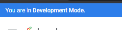

# <https§§§www.cloudskillsboost.google§games§4423§labs§28617>
> <https://www.cloudskillsboost.google/games/4423/labs/28617>

# Modularizing LookML Code with Extends

## Task 1. Extend a view to add columns from another view





```sql
view: location {
  extension: required
  dimension: city {
    type: string
    sql: ${TABLE}.city ;;
  }
  dimension: state {
    type: string
    sql: ${TABLE}.state ;;
    map_layer_name: us_states
  }
  dimension: zip {
    type: zipcode
    sql: ${TABLE}.zip ;;
  }
  dimension: country {
    type: string
    map_layer_name: countries
    sql: ${TABLE}.country ;;
  }
  
  dimension: latitude {
    type: number
    sql: ${TABLE}.latitude ;;
  }
  
  dimension: longitude {
    type: number
    sql: ${TABLE}.longitude ;;
  }
}
```


## Test the extended view for Users and Events in the Order Items Explore


Click Validate LookML and then click Commit Changes & Push.


## Task 2. Extend an Explore to add joins from another Explore


```sql
explore: base_events {
  extension: required
  join: event_session_facts {
    type: left_outer
    sql_on: ${events.session_id} = ${event_session_facts.session_id} ;;
    relationship: many_to_one
  }
  join: users {
    type: left_outer
    sql_on: ${events.user_id} = ${users.id} ;;
    relationship: many_to_one
  }
}```

and 
```
description: "Start here for Event analysis"
  fields: [ALL_FIELDS*]
from: events
  view_name: events
  extends: [base_events]
  ```

add

```
explore: conversions {
  description: "Start here for Conversion Analysis"
  fields: [ALL_FIELDS*, -order_items.total_revenue_from_completed_orders]
  from: events
  view_name: events
  extends: [base_events]
  join: order_items {
    type: left_outer
    sql_on: ${users.id} = ${order_items.user_id} ;;
    relationship: many_to_many
  }
}
```