# <https§§§www.cloudskillsboost.google§games§4423§labs§28618>
> <https://www.cloudskillsboost.google/games/4423/labs/28618>

# Troubleshooting Data Models in Looker

## Tools for troubleshooting LookML code and common use cases

[https://docs.looker.com/data-modeling/getting-started/lookml-validation#validating_your_lookml](../https§§§docs.looker.com§data-modeling§getting-started§lookml-validation#validating_your_lookml/readme.md)
SQL Runner
Content Validator
[https://docs.looker.com/reference/looker-error-catalog](../https§§§docs.looker.com§reference§looker-error-catalog/readme.md)

## Task 1. Use SQL Runner to explore available data and troubleshoot SQL queries

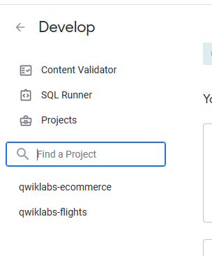

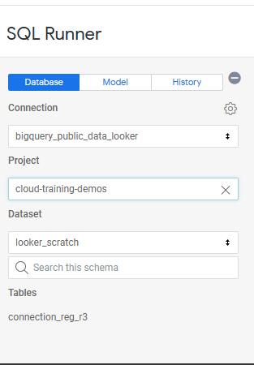

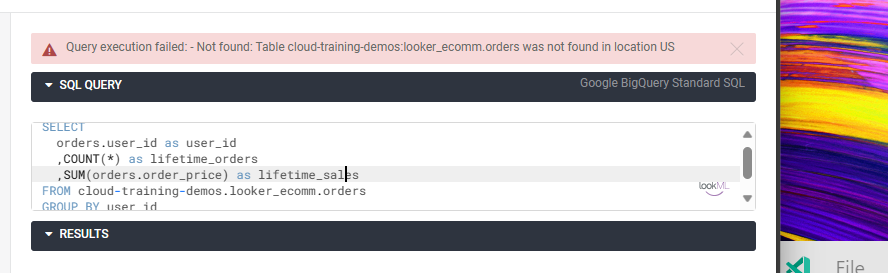

issue

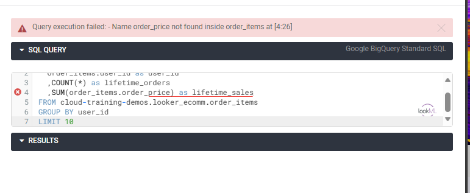

works now

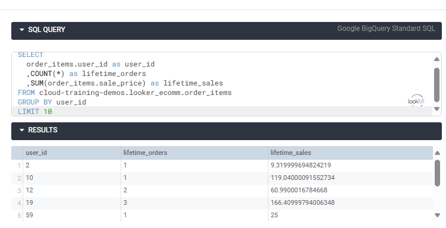

add to project
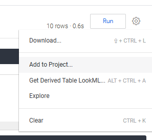

saved as  view
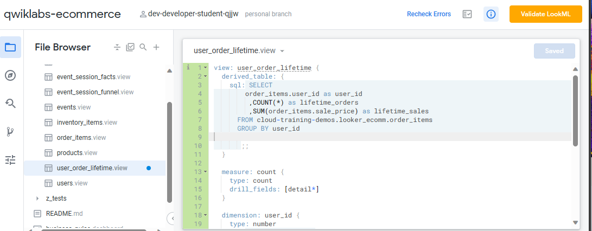

modify model

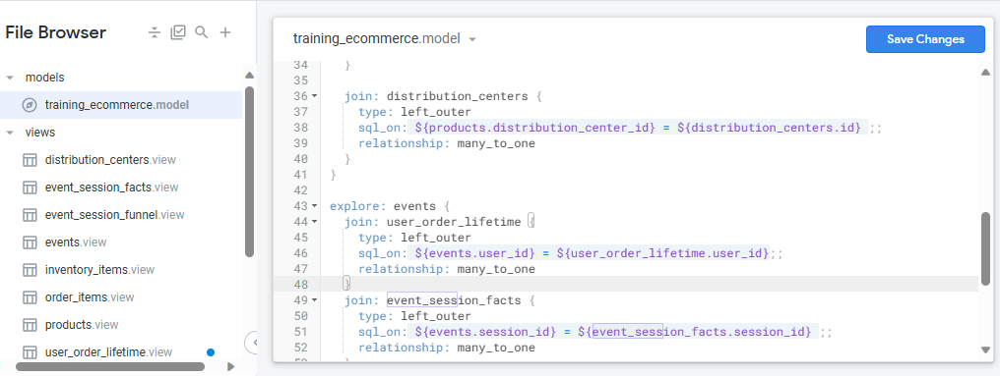

push 
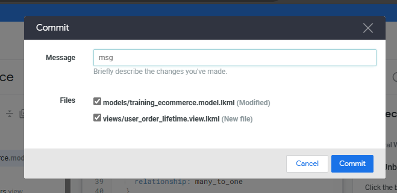

available in sql runner
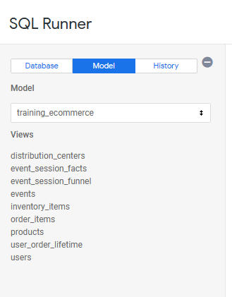

## Task 2. Use the LookML Validator to test syntax and validate relationships defined in the model

syntax error

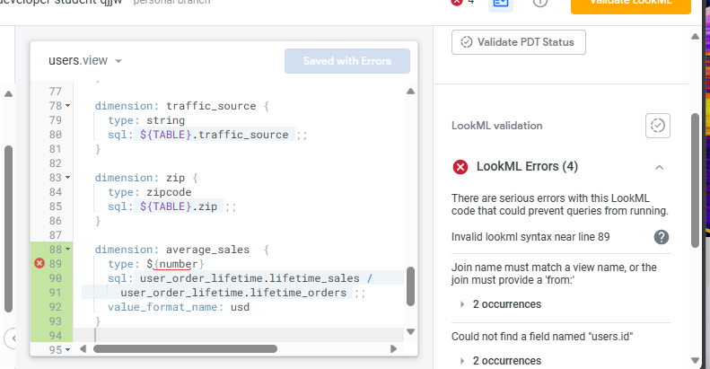

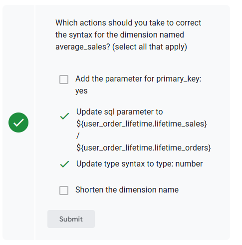

```
dimension: average_sales  {
   type: number
   sql: ${user_order_lifetime.lifetime_sales} /
     ${user_order_lifetime.lifetime_orders} ;;
   value_format_name: usd
  }```

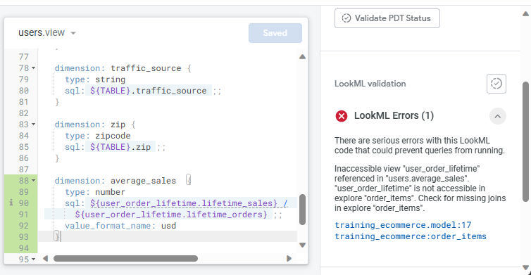

[https://docs.looker.com/reference/looker-error-catalog](../https§§§docs.looker.com§reference§looker-error-catalog/readme.md)

