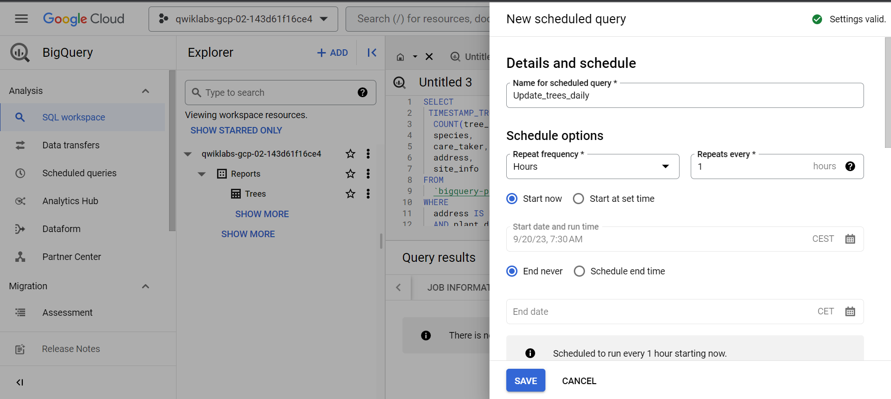

# <https§§§www.cloudskillsboost.google§games§4423§labs§28630>
> <https://www.cloudskillsboost.google/games/4423/labs/28630>

# How to Build a BI Dashboard Using Google Looker Studio and BigQuery


##  Task 4. Scheduling queries in BigQuery

```sql
SELECT
 TIMESTAMP_TRUNC(plant_date, MONTH) as plant_month,
  COUNT(tree_id) AS total_trees,
  species,
  care_taker,
  address,
  site_info
FROM
  `bigquery-public-data.san_francisco_trees.street_trees`
WHERE
  address IS NOT NULL
  AND plant_date >= TIMESTAMP_SUB(CURRENT_TIMESTAMP(), INTERVAL 1 DAY)
  AND plant_date < TIMESTAMP_TRUNC(CURRENT_TIMESTAMP(), DAY)
GROUP BY
  plant_month,
  species,
  care_taker,
  address,
  site_info
  ```
  



## Task 5. Create new data sources in Looker Studio


https://cloud.google.com/blog/products/gcp/how-to-build-a-bi-dashboard-using-google-data-studio-and-bigquery