# <https§§§www.cloudskillsboost.google§games§4424§labs§28636>
> <https://www.cloudskillsboost.google/games/4424/labs/28636>

# Creating and Populating a Bigtable Instance

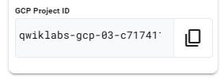
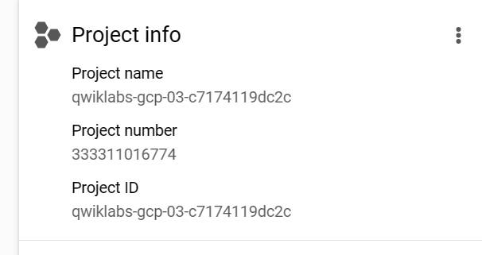
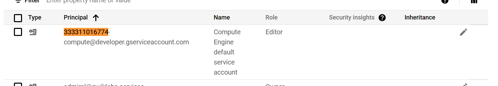
df api
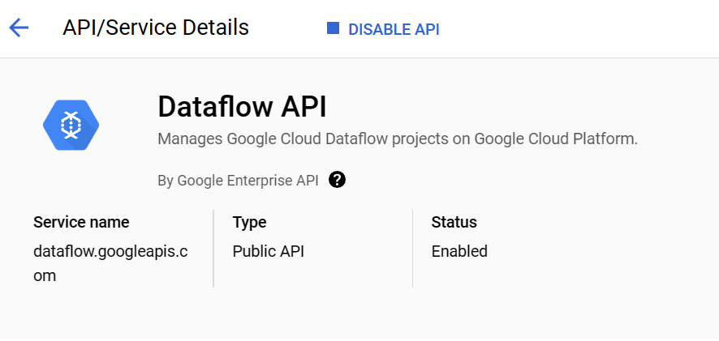

## Task 1. Create a Bigtable instance

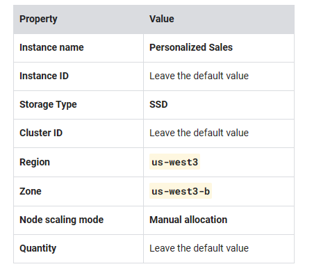
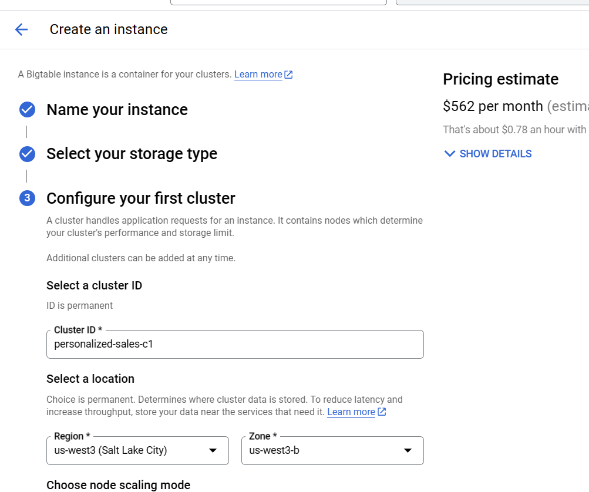    
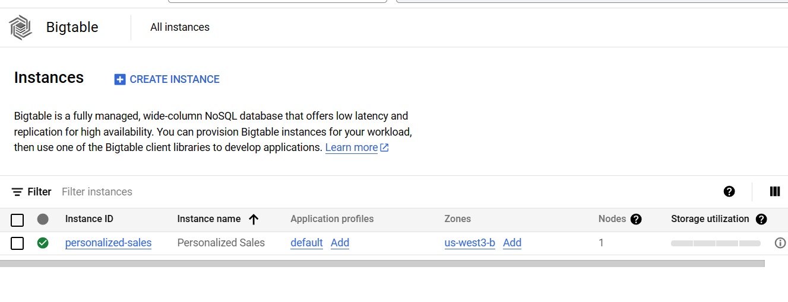

## Task 2. Create a new Bigtable table

create table
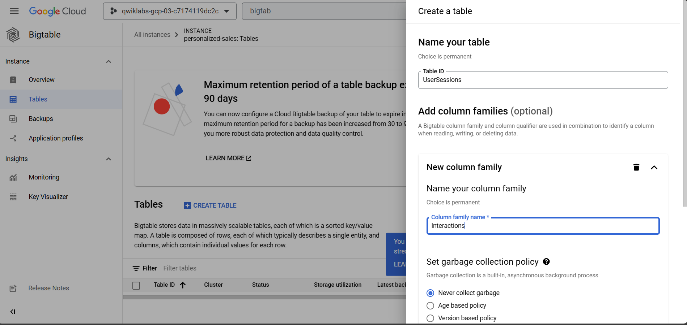

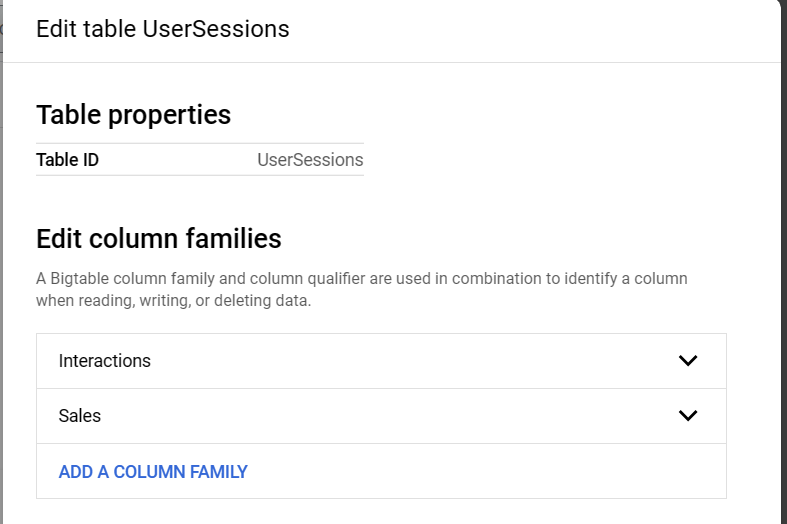

## Task 3. Load data files from Cloud Storage using a Dataflow template
 you run a Dataflow job to load data from Cloud Storage to Bigtable. In order to run the Dataflow job successfully, you first have to create a Cloud Storage bucket for Dataflow to write temporary files as needed. Then you can successfully create and run a new Dataflow job from a template.

 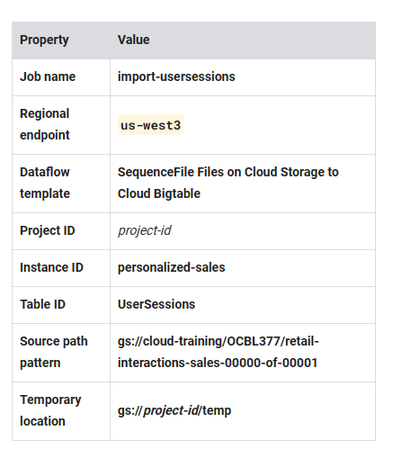

 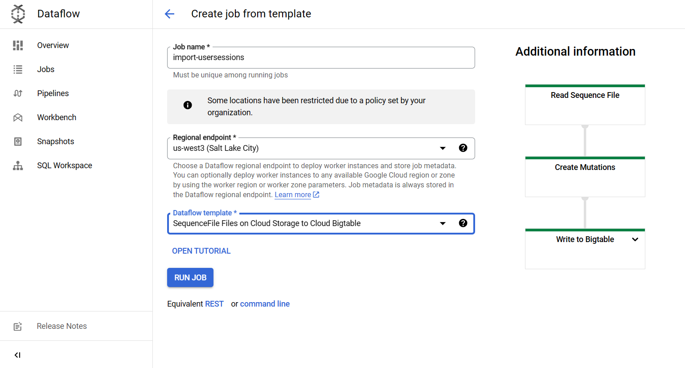

 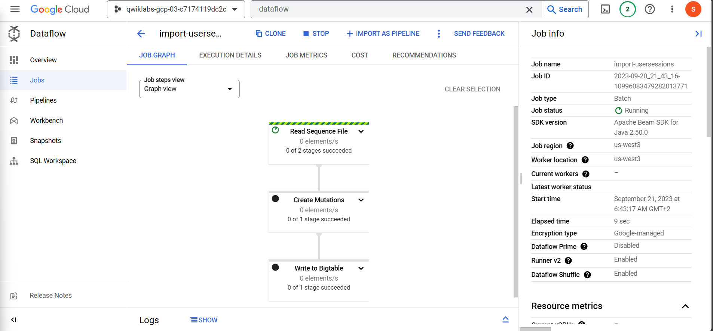

 ## Task 4. Verify data loaded into Bigtable

```bash
echo project = `gcloud config get-value project` \
>> ~/.cbtrc
echo instance = personalized-sales \
>> ~/.cbtrc    
```


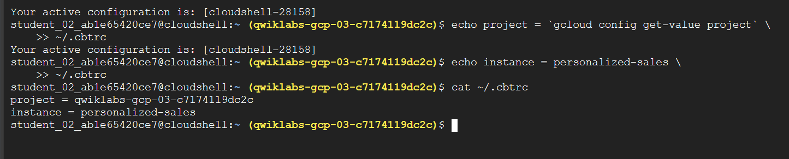


```
cbt read UserSessions \
    count=10
    ```
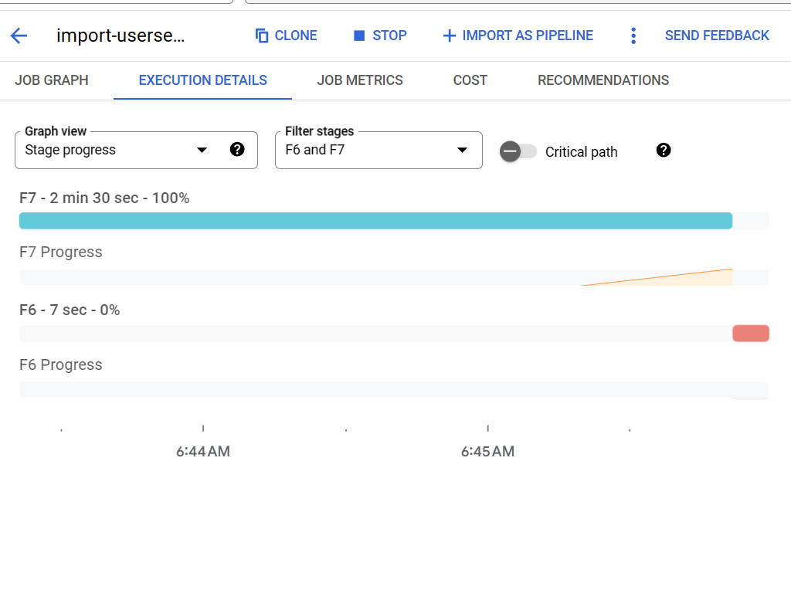

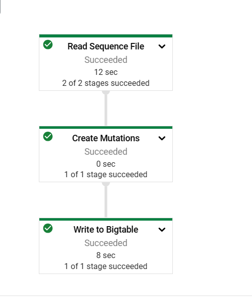

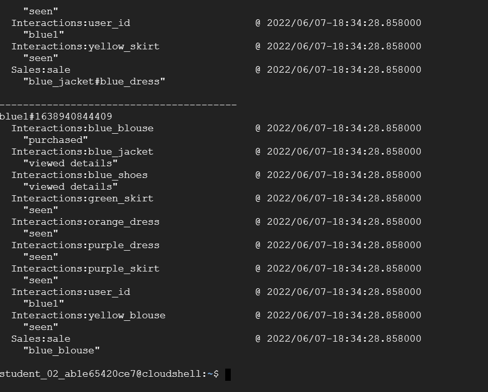