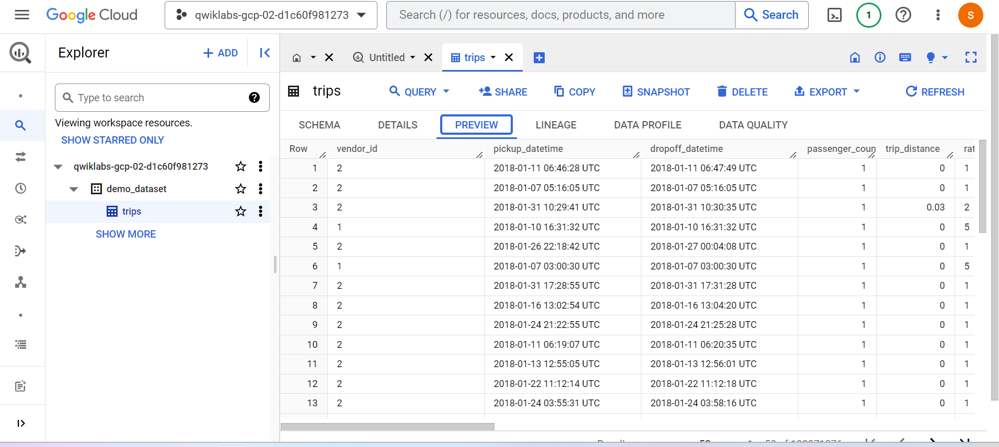
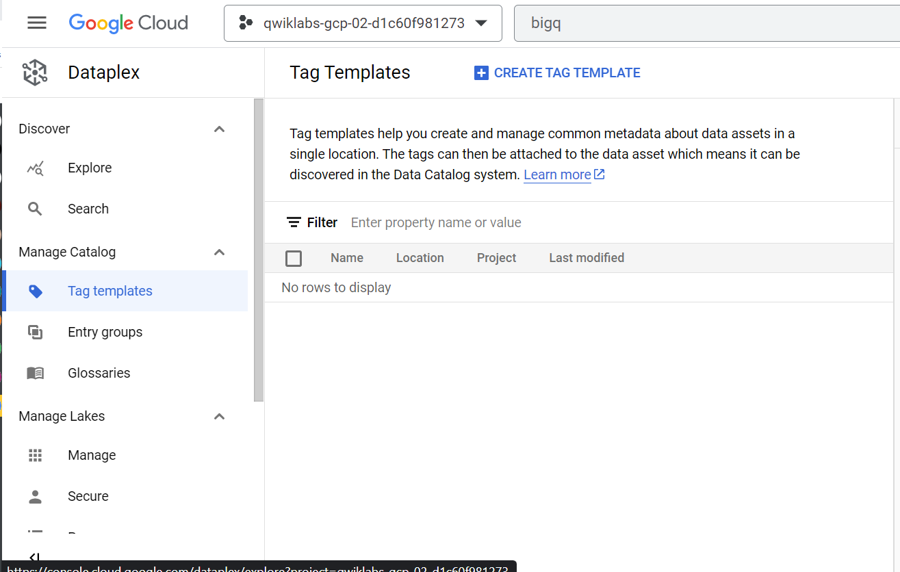
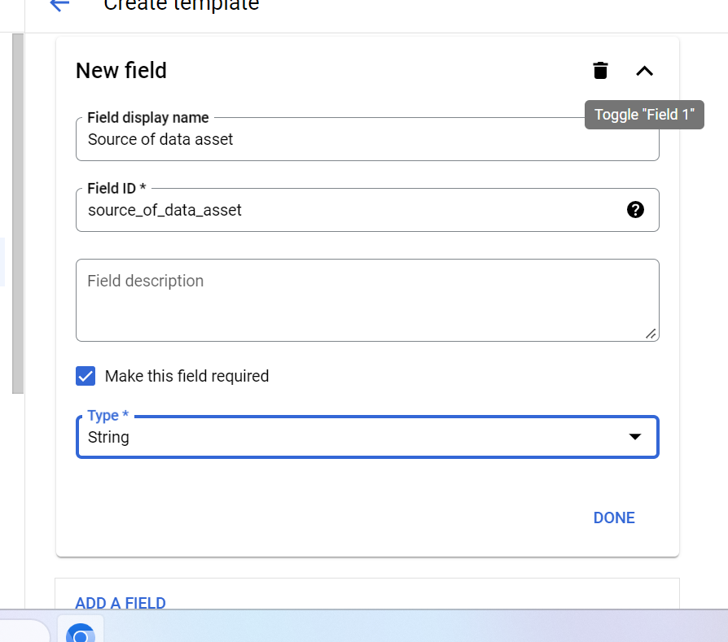
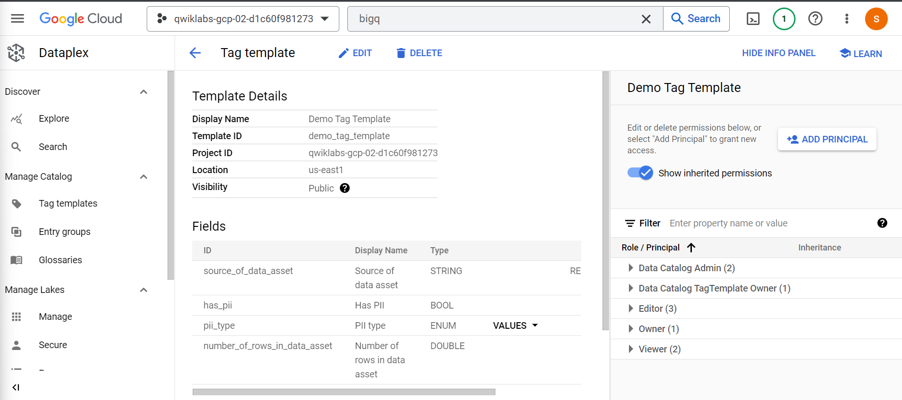
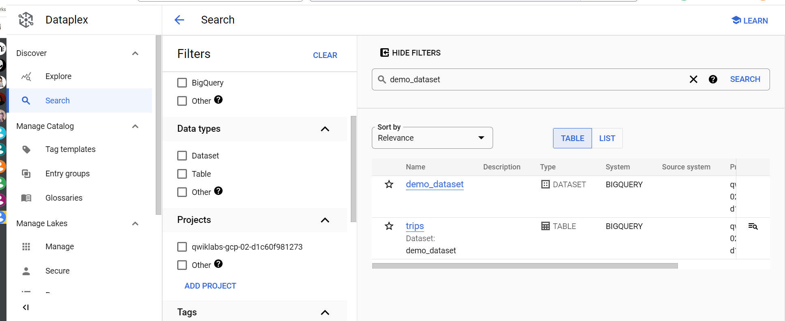
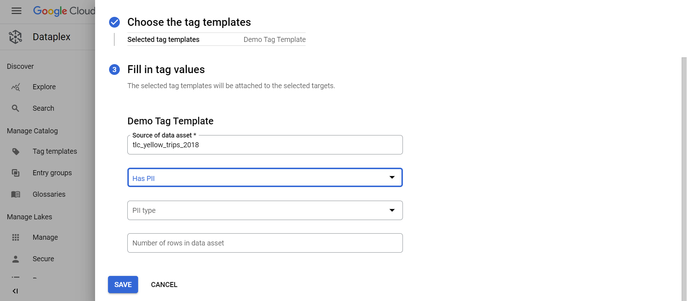

# <https§§§www.cloudskillsboost.google§games§4424§labs§28640>
> <https://www.cloudskillsboost.google/games/4424/labs/28640>

# Data Catalog: Qwik Start
GSP729

[https://cloud.google.com/data-catalog](../https§§§cloud.google.com§data-catalog/readme.md)

## Task 3. Copy a public New York Taxi table to your dataset.


```
bq cp bigquery-public-data:new_york_taxi_trips.tlc_yellow_trips_2018 $(gcloud config get project):demo_dataset.trips
```


## Task 4. Create a Data Catalog tag template








##  Task 5. Tag your table with the newly created tags



