# <https§§§www.cloudskillsboost.google§games§4424§labs§28641>
> <https://www.cloudskillsboost.google/games/4424/labs/28641>

# Tag and Discover BigLake Data: Challenge Lab
ARC123

`us-east1`

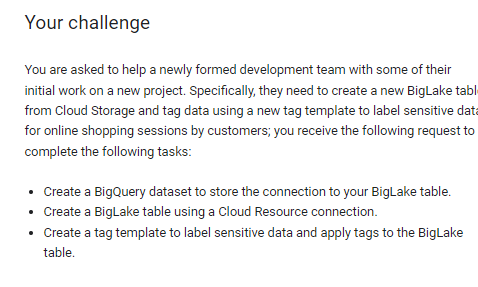

## Task 2. Create a BigLake table using a Cloud Resource connection

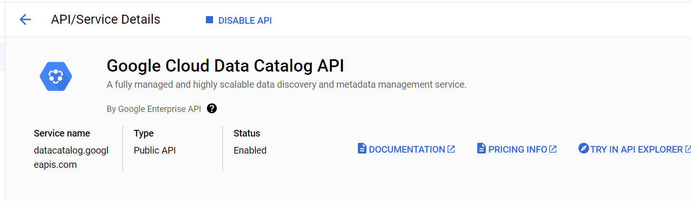

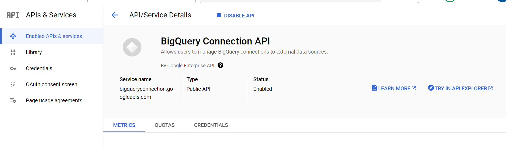

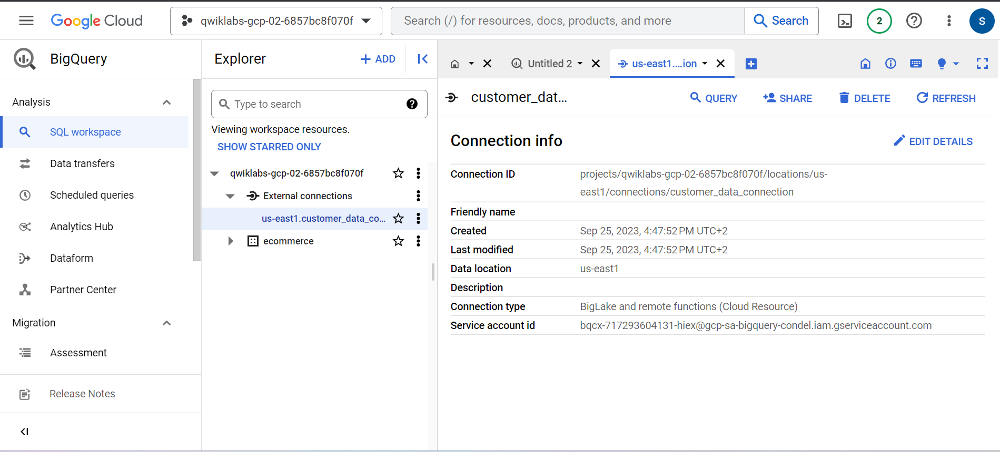

Service account id
bqcx-717293604131-hiex@gcp-sa-bigquery-condel.iam.gserviceaccount.com

IAM

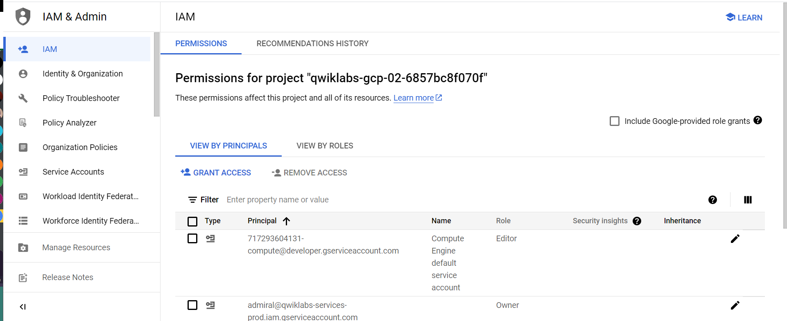

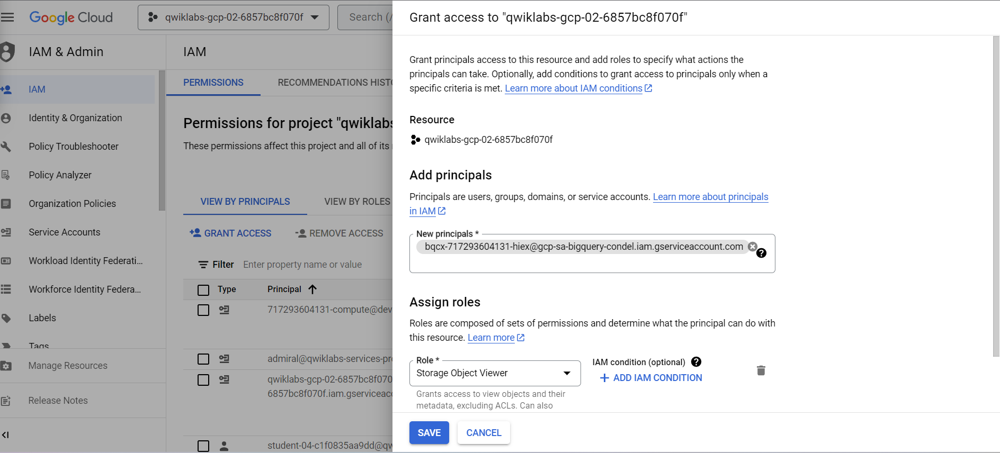

external table
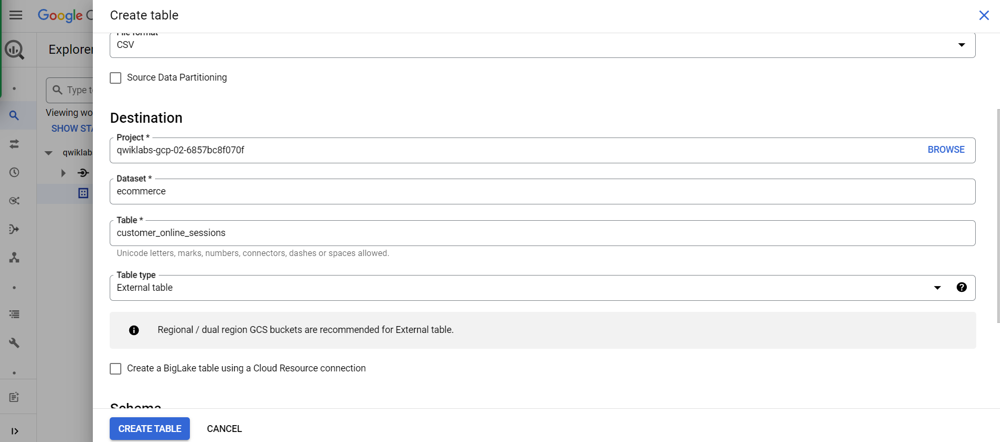

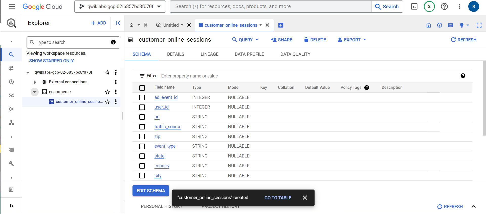

## Task 3. Create a tag template and attach a tag to the BigLake table

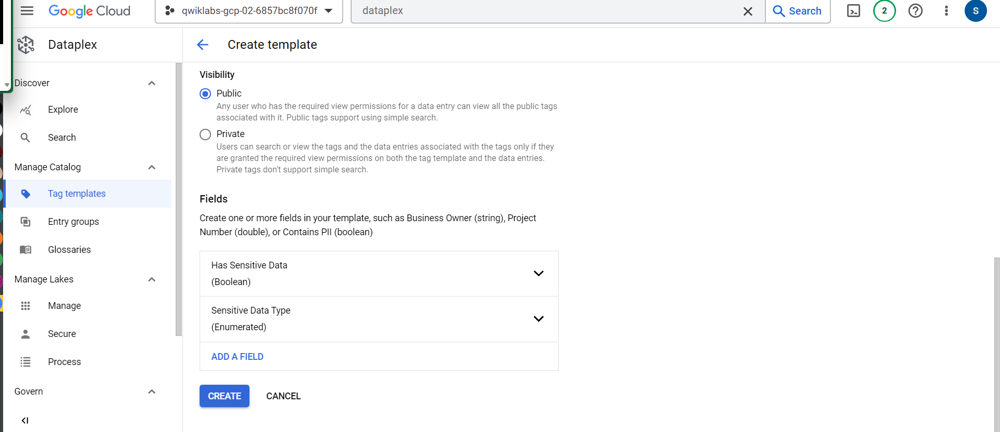

bq exommerce

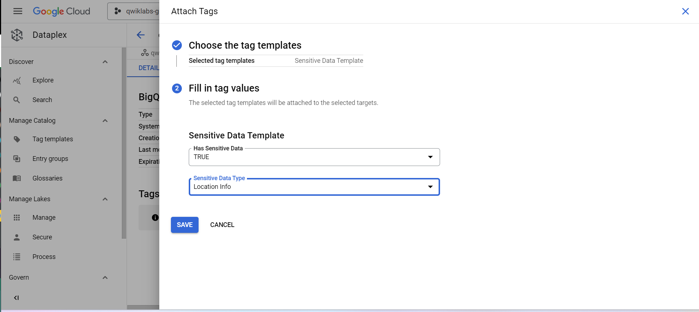

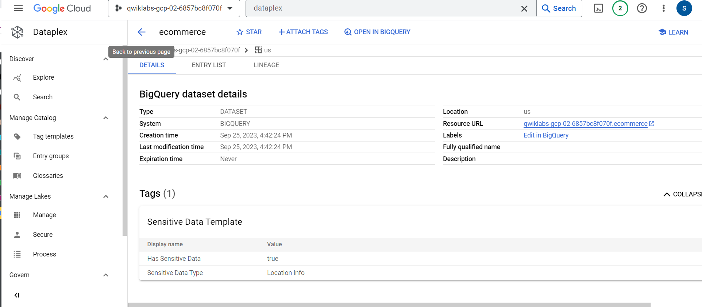