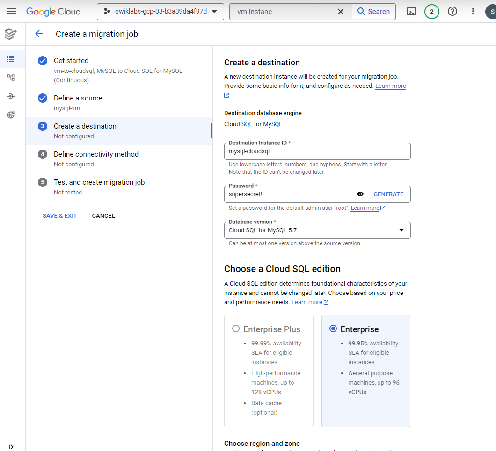
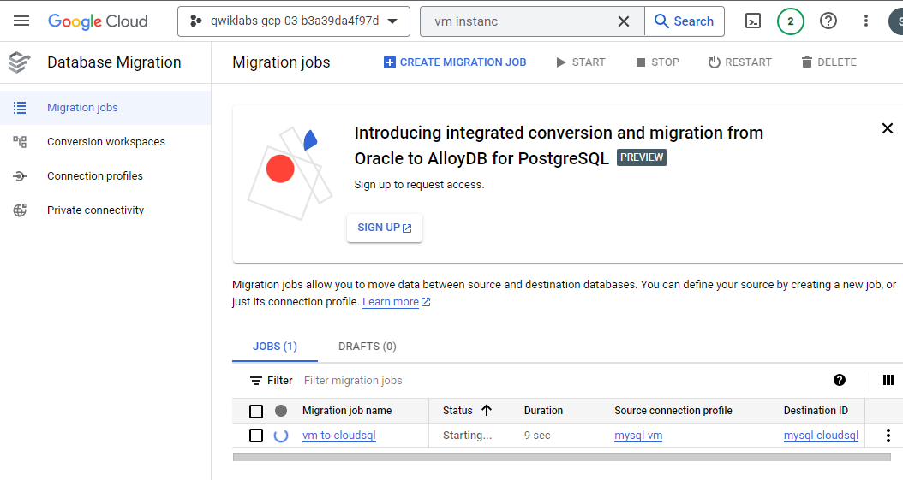

# <https§§§www.cloudskillsboost.google§games§4424§labs§28643>
> <https://www.cloudskillsboost.google/games/4424/labs/28643>

# Migrating On-premises MySQL Using a Continuous Database Migration Service Job

[https://cloud.google.com/database-migration/docs/mysql/configure-connectivity](../https§§§cloud.google.com§database-migration§docs§mysql§configure-connectivity/readme.md)

## Setup

## Task 1. Get the connectivity information for the MySQL source instance

vm instance 

10.128.0.2

connection profile

## Task 3. Create and start a continuous migration job

private ip

test job

create and start

cloud sql

open cloud shell

## Task 6. Test the continuous migration of data from the source to the destination instance

and

same contensta as

## Task 7. Promote Cloud SQL to be a standalone instance for reading and writing data

