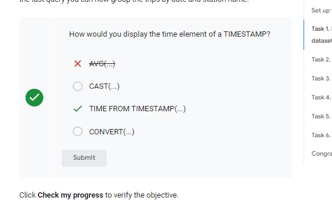
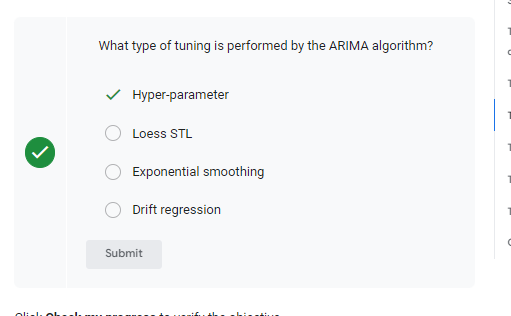
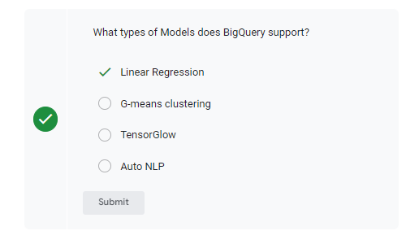

# <https§§§www.cloudskillsboost.google§games§4424§labs§28644>
> <https://www.cloudskillsboost.google/games/4424/labs/28644>

# Building Demand Forecasting with BigQuery ML

GSP852


## Task 1. Explore the NYC Citi Bike Trips dataset

```sql
SELECT
   bikeid,
   starttime,
   start_station_name,
   end_station_name,
FROM
  `bigquery-public-data.new_york_citibike.citibike_trips`
WHERE starttime is not null
LIMIT 5
```

```sql
SELECT
   bikeid,
   starttime,
   start_station_name,
   end_station_name,
FROM
  `bigquery-public-data.new_york_citibike.citibike_trips`
WHERE starttime is not null
LIMIT 5
```



## Task 2. Cleaned training data

```sql
SELECT
 DATE(starttime) AS trip_date,
 start_station_id,
 COUNT(*) AS num_trips
FROM
 `bigquery-public-data.new_york_citibike.citibike_trips`
WHERE
 starttime BETWEEN DATE('2014-01-01') AND ('2016-01-01')
 AND start_station_id IN (521,435,497,293,519)
GROUP BY
 start_station_id,
 trip_date
 ```

## Task 3. Training a model

```sql
CREATE OR REPLACE MODEL bqmlforecast.bike_model
  OPTIONS(
    MODEL_TYPE='ARIMA',
    TIME_SERIES_TIMESTAMP_COL='trip_date',
    TIME_SERIES_DATA_COL='num_trips',
    TIME_SERIES_ID_COL='start_station_id',
    HOLIDAY_REGION='US'
  ) AS
  SELECT
    trip_date,
    start_station_id,
    num_trips
  FROM
    bqmlforecast.training_data
```


## Task 4. Evaluate the time series model

```sql
SELECT
  *
FROM
  ML.EVALUATE(MODEL bqmlforecast.bike_model)
```

## Task 5. Make predictions using the model

```
 DECLARE HORIZON STRING DEFAULT "30"; #number of values to forecast
 DECLARE CONFIDENCE_LEVEL STRING DEFAULT "0.90";
 EXECUTE IMMEDIATE format("""
     SELECT
         *
     FROM
       ML.FORECAST(MODEL bqmlforecast.bike_model,
                   STRUCT(%s AS horizon,
                          %s AS confidence_level)
                  )
     """, HORIZON, CONFIDENCE_LEVEL)
```


## Task 6. Other datasets to explore
 
[https://cloud.google.com/bigquery/public-data](../https§§§cloud.google.com§bigquery§public-data/readme.md)

ex
[https://console.cloud.google.com/bigquery?p=bigquery-public-data&d=chicago_taxi_trips&page=dataset](../https§§§console.cloud.google.com§bigquery§p=bigquery-public-data&d=chicago_taxi_trips&page=dataset/readme.md)


[https://cloud.google.com/blog/topics/developers-practitioners/how-build-demand-forecasting-models-bigquery-ml](../https§§§cloud.google.com§blog§topics§developers-practitioners§how-build-demand-forecasting-models-bigquery-ml/readme.md)
