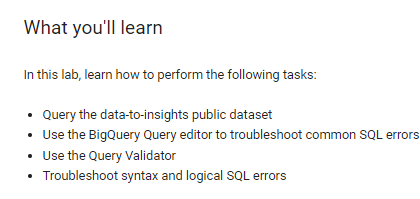
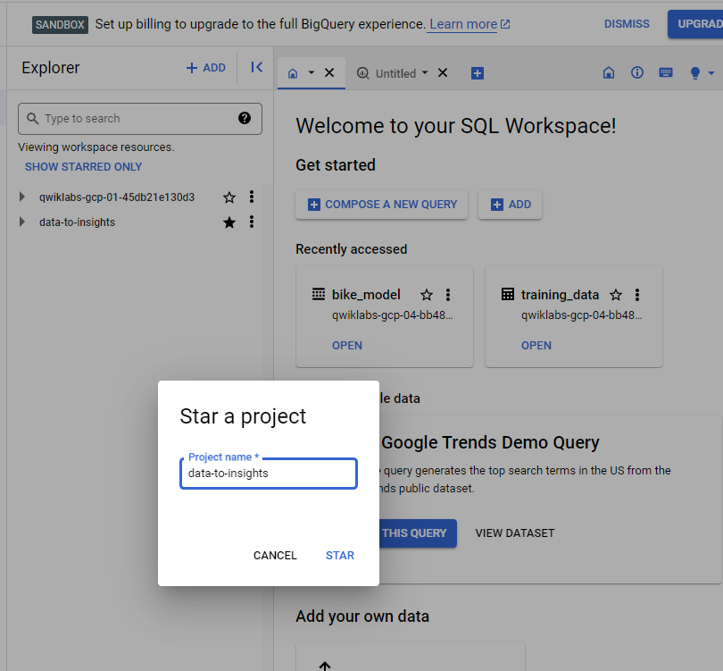
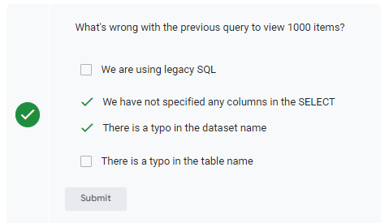
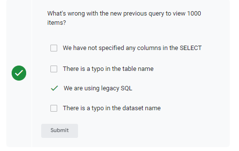
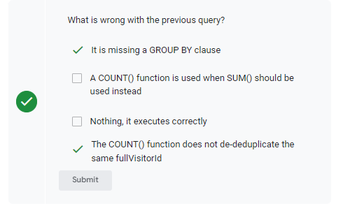
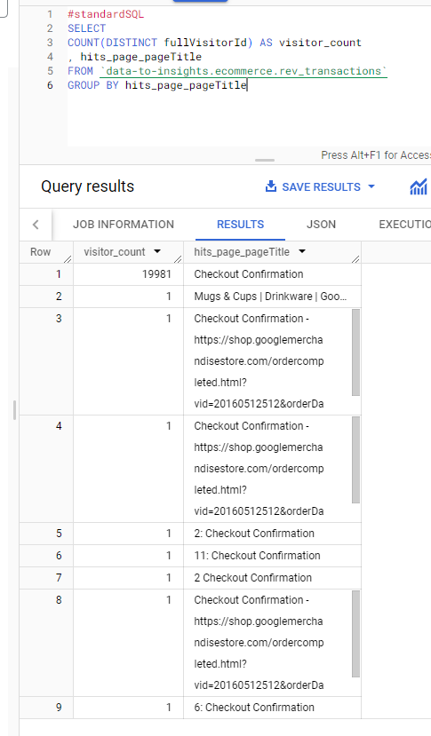
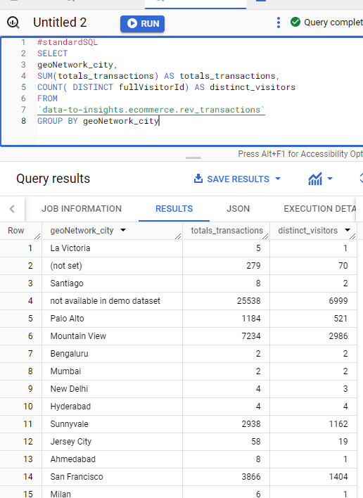
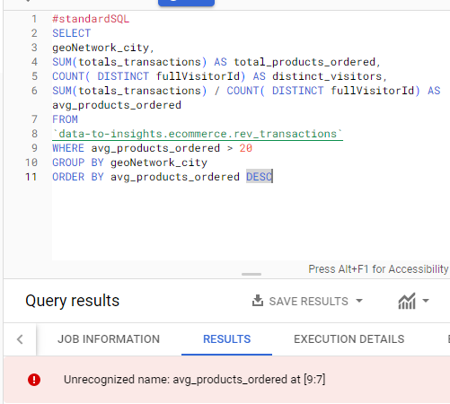
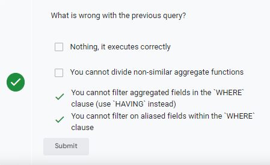

# <https§§§www.cloudskillsboost.google§games§4424§labs§28647>
> <https://www.cloudskillsboost.google/games/4424/labs/28647>

# Troubleshooting Common SQL Errors with BigQuery
GSP408



## Task 1. Open BigQuery and Pin a project to the Resource tree



## Task 2. BigQuery Query editor

[https://cloud.google.com/bigquery/docs/reference/standard-sql/query-syntax](../https§§§cloud.google.com§bigquery§docs§reference§standard-sql§query-syntax/readme.md)

## Task 3. Find the total number of customers who went through checkout

```
#standardSQL
SELECT  FROM `data-to-inghts.ecommerce.rev_transactions` LIMIT 1000
```


```
#standardSQL
SELECT * FROM [data-to-insights:ecommerce.rev_transactions] LIMIT 1000
```



```
#standardSQL
SELECT FROM `data-to-insights.ecommerce.rev_transactions`
```

```
#standardSQL
SELECT fullVisitorId hits_page_pageTitle
FROM `data-to-insights.ecommerce.rev_transactions` LIMIT 1000
```

```
#standardSQL
SELECT
  fullVisitorId
  , hits_page_pageTitle
FROM `data-to-insights.ecommerce.rev_transactions` LIMIT 1000
```

```
#standardSQL
SELECT
COUNT(fullVisitorId) AS visitor_count
, hits_page_pageTitle
FROM `data-to-insights.ecommerce.rev_transactions`
```


correct



## Task 4. List the cities with the most transactions with your ecommerce site

```
#standardSQL
SELECT
geoNetwork_city,
SUM(totals_transactions) AS totals_transactions,
COUNT( DISTINCT fullVisitorId) AS distinct_visitors
FROM
`data-to-insights.ecommerce.rev_transactions`
GROUP BY geoNetwork_city
```

avg products per order by city

```
#standardSQL
SELECT
geoNetwork_city,
SUM(totals_transactions) AS total_products_ordered,
COUNT( DISTINCT fullVisitorId) AS distinct_visitors,
SUM(totals_transactions) / COUNT( DISTINCT fullVisitorId) AS avg_products_ordered
FROM
`data-to-insights.ecommerce.rev_transactions`
GROUP BY geoNetwork_city
ORDER BY avg_products_ordered DESC
```






```
#standardSQL
SELECT
geoNetwork_city,
SUM(totals_transactions) AS total_products_ordered,
COUNT( DISTINCT fullVisitorId) AS distinct_visitors,
SUM(totals_transactions) / COUNT( DISTINCT fullVisitorId) AS avg_products_ordered
FROM
`data-to-insights.ecommerce.rev_transactions`
GROUP BY geoNetwork_city
HAVING avg_products_ordered > 20
ORDER BY avg_products_ordered DESC
```

## Task 5. Find the total number of products in each product category

```
#standardSQL
SELECT
COUNT(DISTINCT hits_product_v2ProductName) as number_of_products,
hits_product_v2ProductCategory
FROM `data-to-insights.ecommerce.rev_transactions`
WHERE hits_product_v2ProductName IS NOT NULL
GROUP BY hits_product_v2ProductCategory
ORDER BY number_of_products DESC
LIMIT 5```