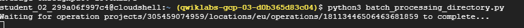

# <https§§§www.cloudskillsboost.google§games§4424§labs§28650>
> <https://www.cloudskillsboost.google/games/4424/labs/28650>

# Optical Character Recognition (OCR) with Document AI (Python)
GSP1138

https://cloud.google.com/document-ai/docs


## Task 1. Enable the Document AI API


```
gcloud services enable documentai.googleapis.com
gcloud services enable storage.googleapis.com
```

## Task 2. Create and test a processor


ocr


## Task 3. Authenticate API requests

```bash
# set an environment
export GOOGLE_CLOUD_PROJECT=$(gcloud config get-value core/project)

# new sa to access the document ai
gcloud iam service-accounts create my-docai-sa \
  --display-name "my-docai-service-account"

# Give your service account permissions to access Document AI, Cloud Storage, and Service Usage

gcloud projects add-iam-policy-binding ${GOOGLE_CLOUD_PROJECT} \
    --member="serviceAccount:my-docai-sa@${GOOGLE_CLOUD_PROJECT}.iam.gserviceaccount.com" \
    --role="roles/documentai.admin"
gcloud projects add-iam-policy-binding ${GOOGLE_CLOUD_PROJECT} \
    --member="serviceAccount:my-docai-sa@${GOOGLE_CLOUD_PROJECT}.iam.gserviceaccount.com" \
    --role="roles/storage.admin"
gcloud projects add-iam-policy-binding ${GOOGLE_CLOUD_PROJECT} \
    --member="serviceAccount:my-docai-sa@${GOOGLE_CLOUD_PROJECT}.iam.gserviceaccount.com" \
    --role="roles/serviceusage.serviceUsageConsumer"

# Create credentials that your Python code uses to login as your new service account. Create these credentials and save it as a JSON file ~/key.json

gcloud iam service-accounts keys create ~/key.json \
  --iam-account  my-docai-sa@${GOOGLE_CLOUD_PROJECT}.iam.gserviceaccount.com

# set the GOOGLE_APPLICATION_CREDENTIALS environment variable, which is used by the library to find your credentials
export GOOGLE_APPLICATION_CREDENTIALS=$(realpath key.json)
```
https://cloud.google.com/docs/authentication/production

## Task 4. Install the client library

```
pip3 install --upgrade google-cloud-documentai
pip3 install --upgrade google-cloud-storage
```

https://cloud.google.com/python/setup


```
gcloud storage cp gs://cloud-samples-data/documentai/codelabs/ocr/Winnie_the_Pooh_3_Pages.pdf .
```

## Task 5. Make an online processing request

This method is best suited for smaller documents that are stored locally


[here](./online_processing.py)
```
python3 online_processing.py
```


## Task 6. Make a batch processing request


```
gcloud storage buckets create gs://$GOOGLE_CLOUD_PROJECT
gcloud storage cp gs://cloud-samples-data/documentai/codelabs/ocr/Winnie_the_Pooh.pdf gs://$GOOGLE_CLOUD_PROJECT/
```

[here](./batch_processing.py)

## Task 7. Make a batch processing request for a directory


```
gcloud storage cp --recursive gs://cloud-samples-data/documentai/codelabs/ocr/multi-document gs://$GOOGLE_CLOUD_PROJECT/
```

[here](./batch_processing_directory.py)




