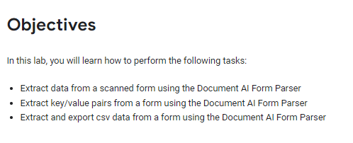
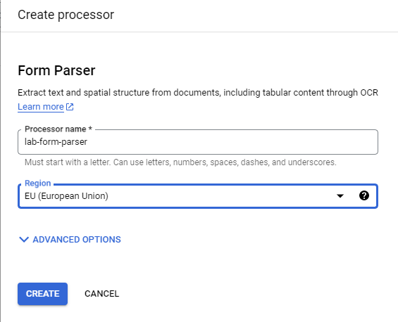
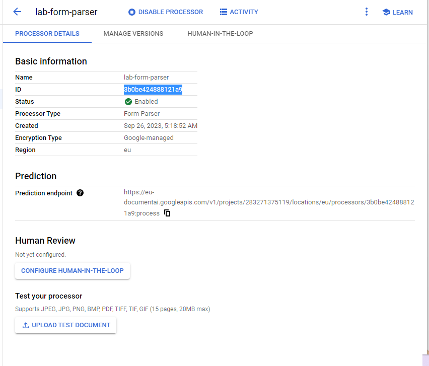
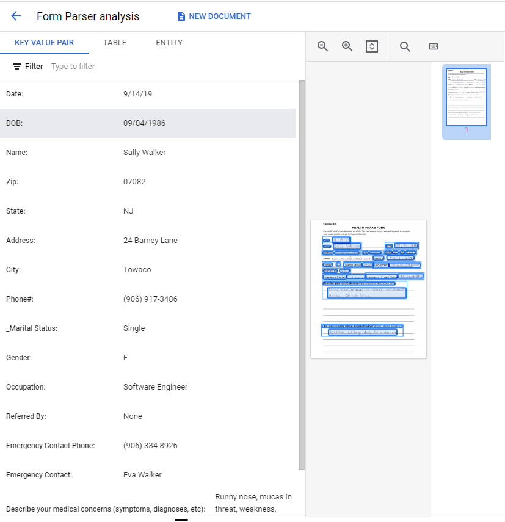
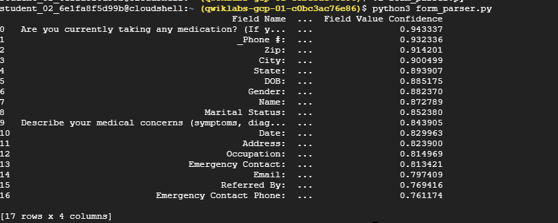
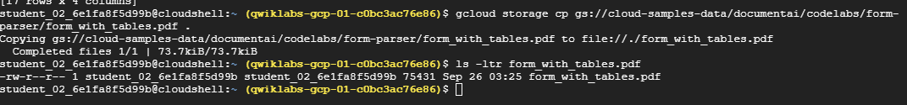
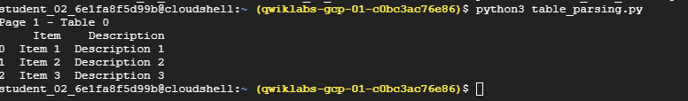

# <https§§§www.cloudskillsboost.google§games§4424§labs§28651>
> <https://www.cloudskillsboost.google/games/4424/labs/28651>

# Form Parsing with Document AI (Python)

GSP1139



## Task 1. Enable the Document AI API

```
gcloud services enable documentai.googleapis.com


pip3 install --upgrade pandas

pip3 install --upgrade google-cloud-documentai
```

## Task 2. Create a Form Parser processor



3b0be424888121a9





## Task 3. Download the sample form

```
gcloud storage cp gs://cloud-samples-data/documentai/codelabs/form-parser/intake-form.pdf .

ls -ltr intake-form.pdf
```


## Task 4. Extract form key/value pairs

```

python3 form_parser.py
```



## Task 5. Parse tables


```
gcloud storage cp gs://cloud-samples-data/documentai/codelabs/form-parser/form_with_tables.pdf .

ls -ltr form_with_tables.pdf
```



[here](./table_parsing.py)

