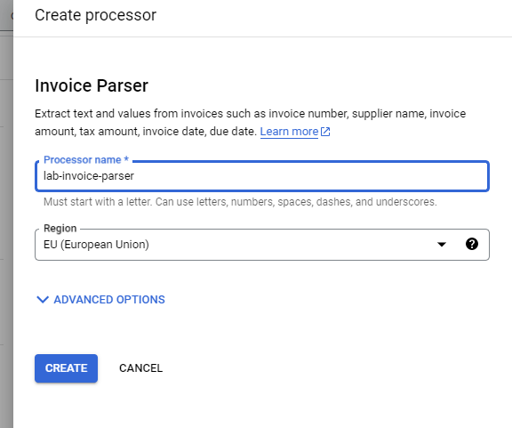
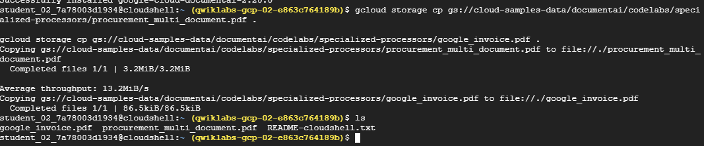
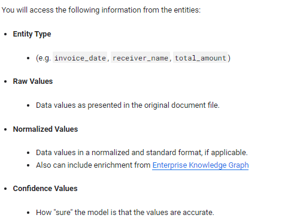
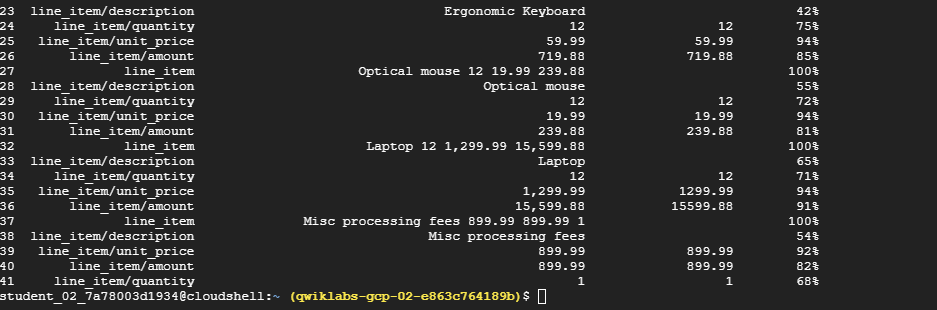
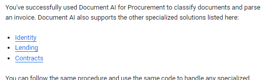

# <https§§§www.cloudskillsboost.google§games§4424§labs§28652>
> <https://www.cloudskillsboost.google/games/4424/labs/28652>

# Using Specialized Processors with Document AI (Python)
GSP1140

## Task 1. Enable the Document AI API

```
gcloud services enable documentai.googleapis.com


pip3 install --upgrade pandas

pip3 install --upgrade google-cloud-documentai

```

## Task 2. Create a Form Parser processor



3d52c47998cb5fd0

```
gcloud storage cp gs://cloud-samples-data/documentai/codelabs/specialized-processors/procurement_multi_document.pdf .

gcloud storage cp gs://cloud-samples-data/documentai/codelabs/specialized-processors/google_invoice.pdf .

```



## Task 3. Extract the entities
 
 

[here](./extraction.py)



## Optional: Try out other specialized processors




https://cloud.google.com/document-ai/docs/output

https://cloud.google.com/python/docs/reference/documentai/latest

https://github.com/GoogleCloudPlatform/document-ai-samples