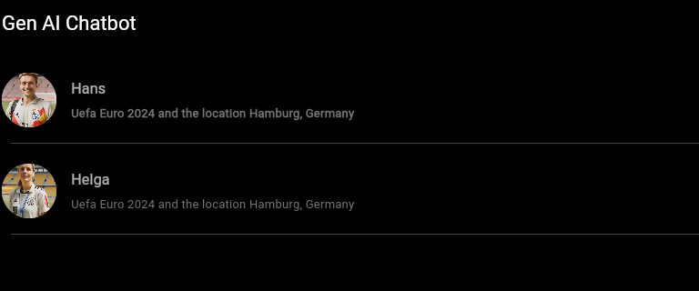
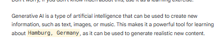
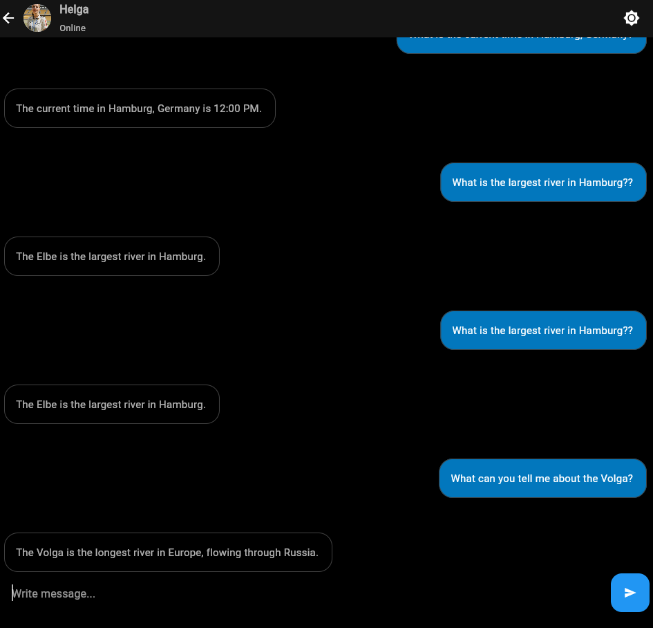
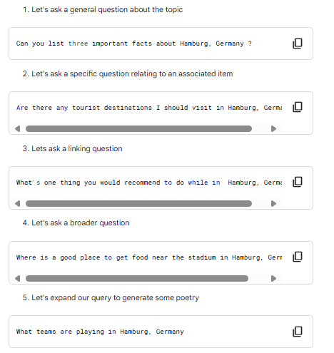
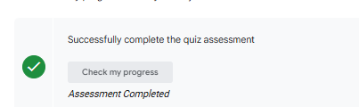

# <https§§§www.cloudskillsboost.google§games§5154§labs§33647>
> <https://www.cloudskillsboost.google/games/5154/labs/33647>

# Generative AI: Hamburg Tour

In this lab learn use a chat application to interact and learn:

The basics of prompt engineering
Why context in relation to AI is important
How to work with Generative AI

## Task 1. Access the Chat Application

[https://genai-chatbot-boqp6rugaq-uw.a.run.app ](.././https§§§genai-chatbot-boqp6rugaq-uw.a.run.app /readme.md)

## Task 2. Using Prompt Engineering

## Task 3. Context is Key

## Task 4. Improving Hamburg, Germany knowledge

## Task 5. Taking the Assessment

