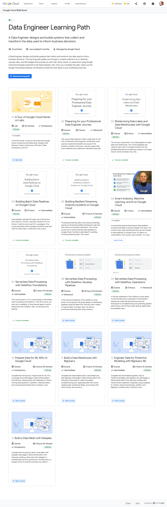

# <https§§§www.cloudskillsboost.google§paths§16>
> <https://www.cloudskillsboost.google/paths/16>

# Data Engineer Learning Path

A Data Engineer designs and builds systems that collect and transform the data used to inform business decisions. This learning path guides you through a curated collection of on-demand courses, labs, and skill badges that provide you with real-world, hands-on experience using Google Cloud technologies essential to the Data Engineer role. Once you complete the path, check out the Google Cloud Data Engineer certification to take the next steps in your professional journey.

